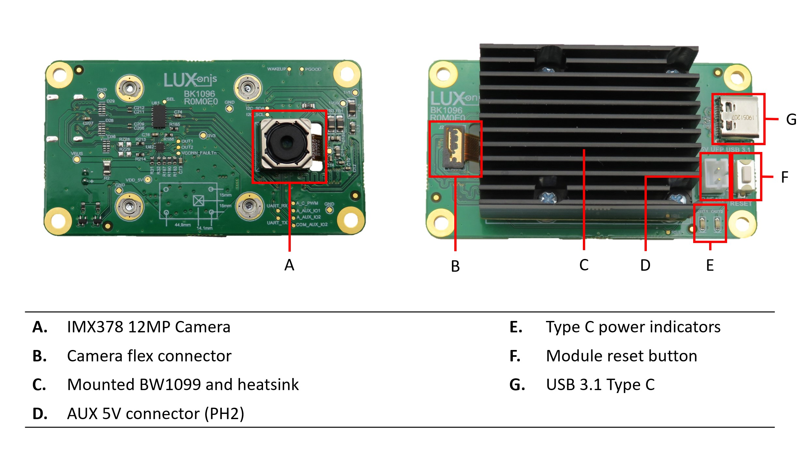

# BK1096_Modular

# Overview

This repository contains open hardware designed by Luxonis, and meant to be used as a baseboard for the [Luxonis](https://www.luxonis.com/depthai) [OAK-SOM](https://docs.luxonis.com/projects/hardware/en/latest/pages/BW1099.html). The BK1096 baseboard offers a quick and simple way to add USB3 Type-C device power and connectivity, and a single 12MP RGB camera module to the OAK SoM.

This is the open-source equivalent of BW1093 (OAK-1, megaAI), using the OAK-SOM (System on Module).  The BW1093 itself cannot be open-sourced because it contains  proprietary chip-down vendor information and therefore cannot be shared publicly.

## Repository structure:
* `PCB` contains the packaged Altium project files
* `Docs` contains project output files
* `Images` contains graphics for readme and reference
* `3D Models` contains generated 3D models of the board
* `Mechanical` contains models of mounts, enclosures, and other mechanical parts

# Key features
* Support 12MP RGB camera module
* Interface for Luxonis OAK-SOM
* USB 3.1 Gen1 Type-C data and power
* USB device power LED indicators
* AUX 5V connector
* Access to SoM 1.8V I2C and UART
* Design files produced with Altium Designer 20

# Board layout & dimensions

# Getting started
The BK1096_R0M0E0 is designed to be powered from the USB Type-C connector. With the BW0249 camera and the DepthAI BW2099 SoM running inference, power consumption is typically about 3W (0.6A @ 5V).

The reset button resets the Luxonis DepthAI OAK-SOM only.

The OUT1 and OUT2 LEDs indicate USB Type-C current mode. See datasheet for TUSB321RWBR Port Control device for more details. 

# Revision info
The design files represent the R1M0E1 revision of this project, though some photos may be of earlier revisions. 
