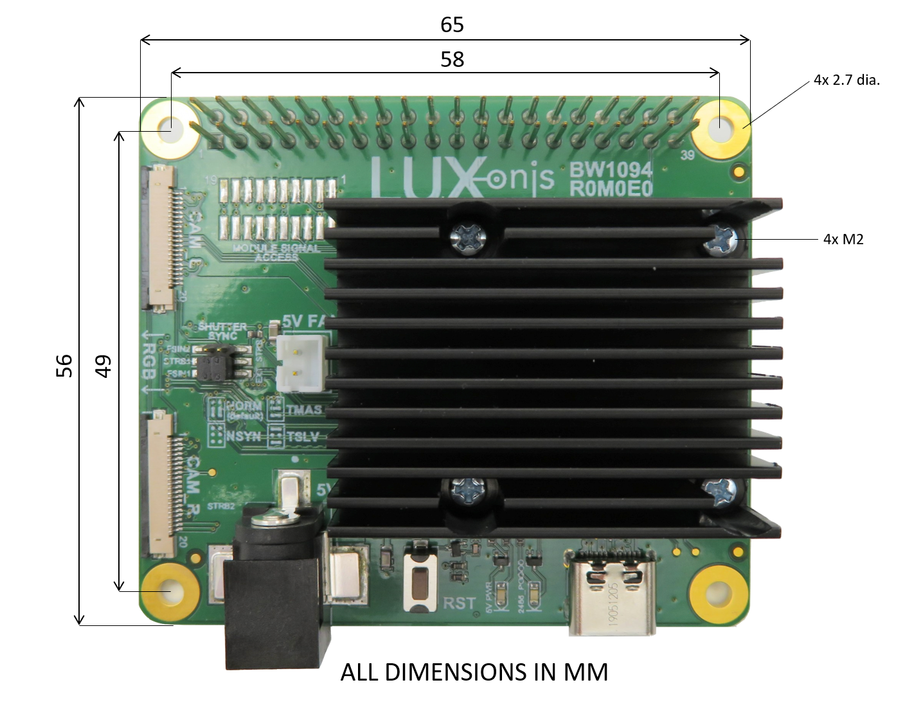

# BW1094_R1M1E1 OAK-FFC RPi HAT Baseboard

[Documentation here](https://docs.luxonis.com/projects/hardware/en/latest/pages/BW1094.html)

# Overview
This repository contains open hardware designed by Luxonis, and meant to be used as a baseboard for the [Luxonis](https://www.luxonis.com/depthai) [OAK-SOM](https://docs.luxonis.com/projects/hardware/en/latest/pages/BW1099.html) and as a HAT for the [RPi "B" models](https://www.raspberrypi.org/products/). The BW1094 baseboard has three FFC interfaces which allow for two [BG0250TG](https://github.com/luxonis/depthai-hardware/tree/master/BG0250TG_DepthAI_Mono_Camera) camera modules (stereo pair) and one [BG0249](https://github.com/luxonis/depthai-hardware/tree/master/BG0249_DepthAI_RGB_Camera) RGB camera module. The GPIO interface from the Raspberry Pi Model B variants is passed through the BW1094 with the exception of the 5V pins, GND pins, and [BCM GPIO26 (pin 37)](https://www.raspberrypi.org/documentation/usage/gpio/), which is used as a way for the Raspberry Pi to reset the OAK SoM, parallel to the RST button.  

# Repository structure:
* `PCB` contains the packaged Altium project files
* `Docs` contains project output files
* `Images` contains graphics for readme and reference
* `3D Models` contains generated mechanical models for the board

# Key features
* 2 BG0250TG mono camera module interfaces
* 1 BG0249 RGB camera module interface
* Pass-thru for standard RPi Model B GPIO header
* Level-shifted reset (BCM GPIO26)
* 5V power input via barrel jack or GPIO header
* USB 3.1 Gen 1 Type-C 
* 5V Fan/Aux header
* Design files produced with Altium Designer 20

# Board layout & dimensions

# Getting started  
The stereo mono cameras ([BG0250TG](https://github.com/luxonis/depthai-hardware/tree/master/BG0250TG_DepthAI_Mono_Camera)) can be connected via FFC to connectors J8 and J9 on the top of the board, while the RGB camera module ([BG0249](https://github.com/luxonis/depthai-hardware/tree/master/BG0249_DepthAI_RGB_Camera)) is connected via FFC to connector J6 on the bottom of the board. These connectors have a Left/Right configuration as perceived by the subject rather than the camera, so "CAM_L" is the subject's left. These designations are somehwhat arbitrary, however, due to the flexibility in positioning the cameras allowed by the FFC. Note that the RGB FFC connector is a top-contact connector while the mono FFC connectors are bottom-contact. This results in the FFCs and cameras all facing the same direction when mounted. 

The BW1094 accepts 5V power from the 5.5mm x 2.5mm barrel jack, or through the Raspberry Pi GPIO header 5V pins. This allows support for standalone use of the BW1094 when it is not mounted as a HAT. When using the BW1094 as a HAT, it is recommended to power the BW1094 from the Raspberry Pi via the 5V GPIO pins. It is also possible to back-power the Raspberry Pi from the BW1094, but this is not recommended. Do not apply power to the BW1094 barrel jack and to the Raspberry Pi at the same time. 

The Raspberry Pi GPIO header mostly passes through the BW1094 with exception of the 5V pins, GND pins, and BCM GPIO26 (pin 37), which is used as a way to toggle reset on the OAK SoM. Reset is active high when toggled from the Raspberry Pi on BCM GPIO26. The 3.3V Raspberry Pi GPIO line is level shifted with an inverter to 1.8V, which is the standard IO for the OAK SoM. OAK SoM reset is active-low 1.8V. The reset button on board the BW1094 resets the Luxonis OAK SoM only. 

Auxiliary 1.8V IO for the OAK SoM exist as J10 pads. The unpopulated connector is [Amphenol/FCI 20021121-00020T1LF](https://octopart.com/20021121-00020t1lf-amphenol+icc+%2F+fci-18075649?r=sp). Quad SPI, UART, I2C, SoM PGOOD, and, SoM WAKEUP are exposed at these pads. *NOTE:* these are all 1.8V signals and will require appropriate level shifting if connected to the 3.3V GPIO of the Raspberry Pi.

The 2485_PGOOD LED indicates "power good" for the OAK SoM. The 5V_PWR LED 5V power is applied to the BW1094.

# Revision info
These files represent the R1M1E1 revision of this project. Please refer to schematic page, `Project_Information.SchDoc` for full details of revision history.
