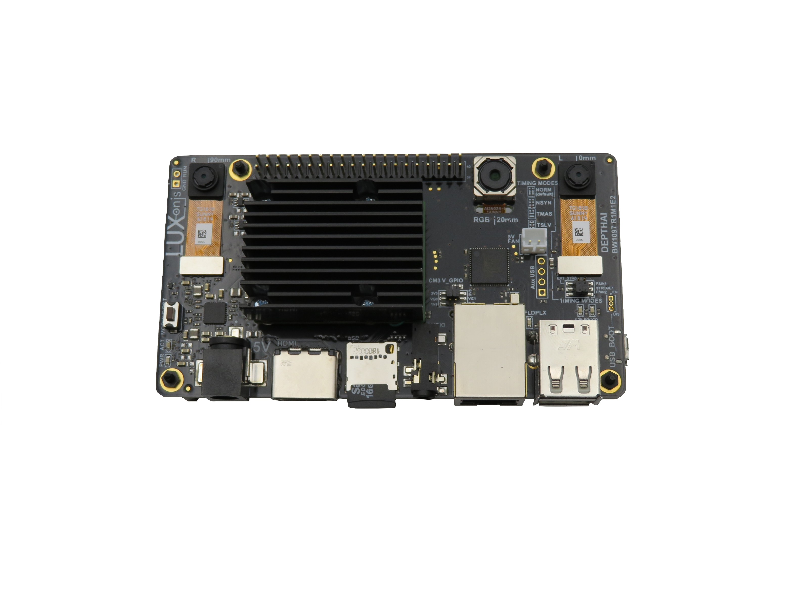
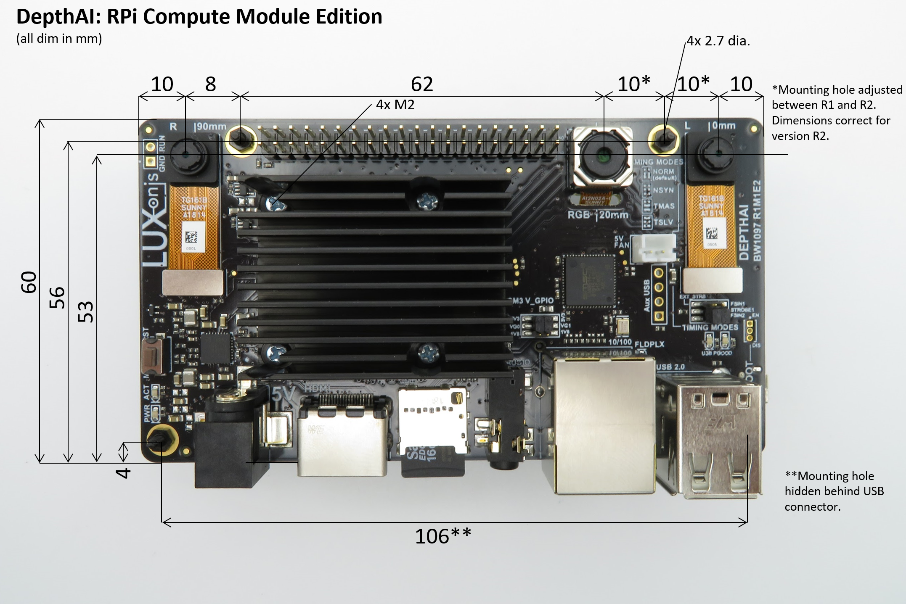

# BW1097_R2M2E3 DepthAI for CM3+

# Overview
This repository contains open hardware designed by Luxonis, and meant to be used as a baseboard for the [Luxonis](https://www.luxonis.com/depthai) BW1099 DepthAI SoM and the [Raspberry Pi Compute Module 3+](https://www.raspberrypi.org/products/compute-module-3-plus/). 

Based on the Raspberry PI CMIO board, the BW1097 combines a host and the Luxonis DepthAI SoM to allow for fully integrated solution for real-time spatial AI. 

# Repository structure:
* `PCB` contains the packaged Altium project files
* `Docs` contains project output files
* `Images` contains graphics for readme and reference
* `3D Models` contains generated mechanical models for the board

# Key features
* Support for on-board stereo and RGB camera modules
* Interface for Luxnois DepthAI SoM
* SODIMM for Raspberry PI CM3/CM3+
* USB2 interface between CM3+ and DepthAI SoM
* 2x USB2
* 1x Aux USB2
* 10/100 Ethernet
* Raspberry PI CSI/DSI support
* Raspberry PI USB boot option
* CM3+ JTAG header
* Standard 40-pin header for CMIO/CM3+ 
* HDMI output
* 5V barrel jack input
* Support for 5V fan
* TRS Audio output
* microSD card support 
* Design files produced with Altium Designer 20

# Board layout & dimensions

# Getting started
The BW1097 accepts 5V (+/-10%) from a 5.5m x 2.5mm barrel jack. Raspberry PI USB boot can be accessed by setting a header jumper, which allows initial flash of eMMC on CM3/CM3+. Alternatively the microSD slot can be used with a bootable system image. The Raspberry PI JTAG header is not populated by default, but can be added, allowing JTAG access. 

The reset button resets the Luxonis DepthAI SoM only. To reset the CM3/CM3+, ground the `RUN` header via to the `GND` header via.

The PWR LED indicates "power good" for the BW1097 on-board PMIC. The ACT LED indicates activity on the CM3/CM3+ device. Other indicator LEDs exist for the two USB2.0 Type A ports and for the 10/100 Ethernet port. 

# Revision info
These files represent the R2M2E3 revision of this project. Please refer to schematic page, `Project_Information.SchDoc` for full details of revision history.
