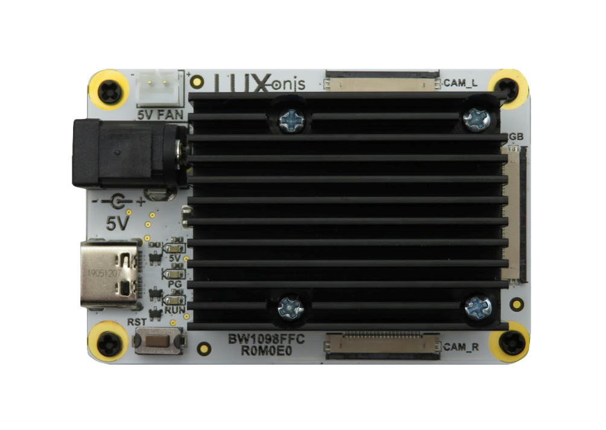
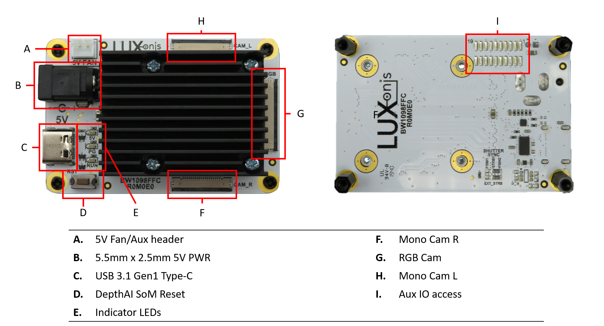

# BW1098FFC_R1M1E1 DepthAI USB3 Edition

# Overview
This repository contains open hardware designed by Luxonis, and meant to be used as a baseboard for the [Luxonis](https://www.luxonis.com/depthai) BW1099 DepthAI SoM. The BW1098FFC baseboard has three FFC interfaces which allow for two [BG0250TG](./depthai-hardware/BG0250TG_DepthAI_Mono_Camera) camera modules (stereo pair) and one [BG0249](./depthai-hardware/BG0249_DepthAI_RGB_Camera) RGB camera module. 

# Repository structure:
* `PCB` contains the packaged Altium project files
* `Docs` contains project output files
* `Images` contains graphics for readme and reference
* `3D Models` contains generated mechanical models for the board

# Key features
* 2 BG0250TG mono camera module interfaces
* 1 BG0249 RGB camera module interface
* 5V power input via barrel jack
* USB 3.1 Gen 1 Type-C
* Pads for DepthAI SoM 1.8V SPI
* Pads for DepthAI SoM 3.3V SDIO 
* Pads for DepthAI SoM 1.8V Aux Signals (I2C, UART, GPIO)
* 5V Fan/Aux header
* Pads for DepthAI SoM aux signals
* Design files produced with Altium Designer 20

# Board layout & dimensions

# Getting started  

The BW1098FFC accepts 5V (+/-10%) from a 5.5m x 2.5mm barrel jack, and interfaces to a host via USB 3.1 Gen1 Type-C. With cameras and the DepthAI SoM, total power consumption usually stays below the 900ma specification of USB 3, but Type-C power of 1.5A or greater is recommended. 

Interfacing with the DepthAI SoM is also possible with BW1098FFC connector pads J3, J4, and J5. These pads are designed for the [Amphenol/FCI 20021121-00010T1LF](https://octopart.com/20021121-00010t1lf-amphenol+icc+%2F+fci-93112650?r=sp) or equivalent. Please refer to the schematics for pinout information. 

The reset button resets the Luxonis DepthAI SoM only. 

The 5V LED indicates 5V power is present on the BW1098FFC. The PG LED indicates "power good" from the DepthAI SoM. The "RUN" LED indicates that the DepthAI SoM is not in reset.

# Revision info
These files represent the R1M1E1 revision of this project. Please refer to schematic page, `Project_Information.SchDoc` for full details of revision history.
