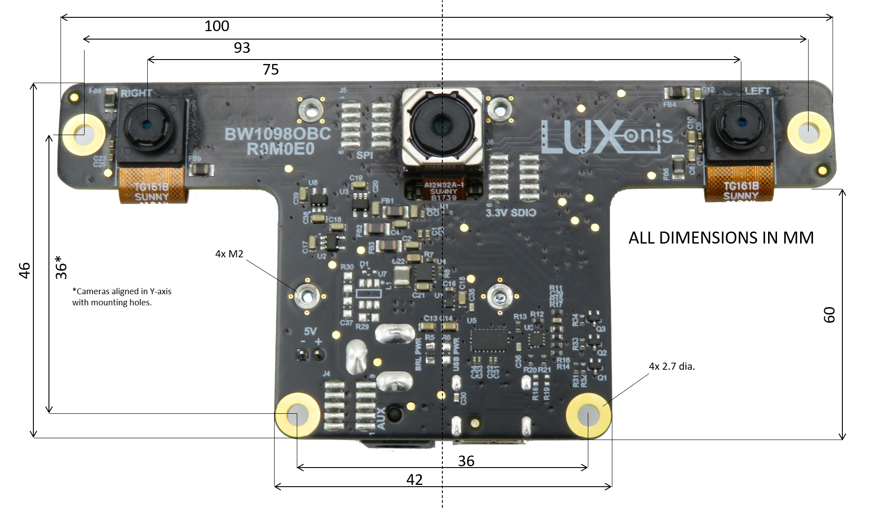
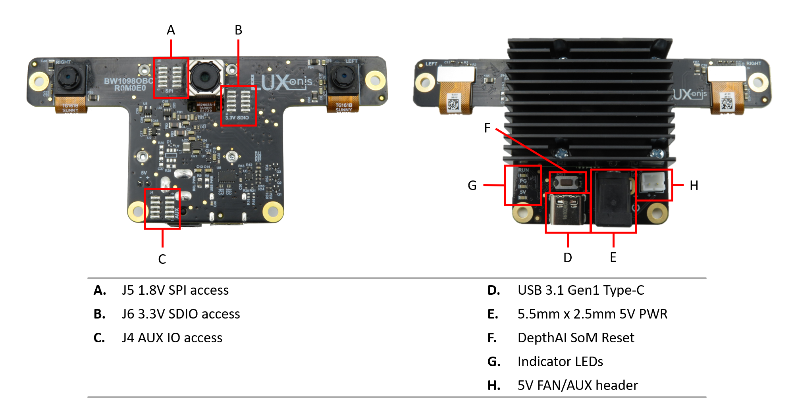

# BW1098OBC DepthAI USB3C Baseboard

# Overview

This repository contains open hardware designed by Luxonis, and meant to be used as a baseboard for the [Luxonis](https://www.luxonis.com/depthai) BW1099 DepthAI SoM. The BW1098OBC baseboard has three on-board cameras which implement stereo and RGB vision, piped directly into the DepthAI SoM for depth and AI processing. The data is then output to a host via USB 3.1 Gen1 (Type-C). 

## Repository structure:
* `PCB` contains the packaged Altium project files
* `Docs` contains project output files
* `Images` contains graphics for readme and reference
* `3D Models` contains generated mechanical models for the board

# Key features
* Support for on-board stereo and RGB camera modules
* Interface for Luxnois DepthAI SoM
* USB 3.1 Gen1 Type-C
* Optional resistor-jumper for USB power
* Pads for DepthAI SoM 1.8V SPI
* Pads for DepthAI SoM 3.3V SDIO 
* Pads for DepthAI SoM 1.8V Aux Signals (I2C, UART, GPIO) 
* 5V barrel jack input
* Support for 5V fan
* Design files produced with Altium Designer 20

# Board layout & dimensions

# Getting started
The BW1098OBC accepts 5V (+/-10%) from a 5.5m x 2.5mm barrel jack, and interfaces to a host via USB 3.1 Gen1 Type-C. Optionally, resistors can be configured on the board to allow for power to be provided via USB. With cameras and the DepthAI SoM, total power consumption usually stays below the 900ma specification of USB 3, but Type-C power of 1.5A or greater is recommended. 

Interfacing with the DepthAI SoM is also possible with BW1098OBC connector pads J4, J5, and J6. These pads are designed for the [Amphenol/FCI 20021121-00010T1LF](https://octopart.com/20021121-00010t1lf-amphenol+icc+%2F+fci-93112650?r=sp) or equivalent. Please refer to the schematics for pinout information.

The reset button resets the Luxonis DepthAI SoM only. 

The 5V LED indicates 5V power is present on the BW1098OBC. The PG LED indicates "power good" from the DepthAI SoM. The "RUN" LED indicates that the DepthAI SoM is not in reset.  

# Revision info
These files represent the R1M0E1 revision of this project. Please refer to schematic page, `Project_Information.SchDoc` for full details of revision history.
