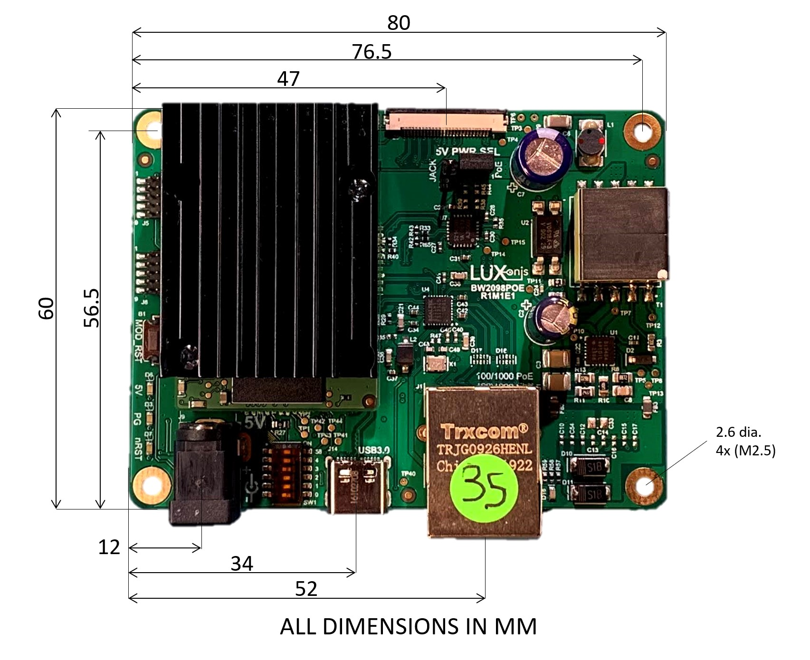
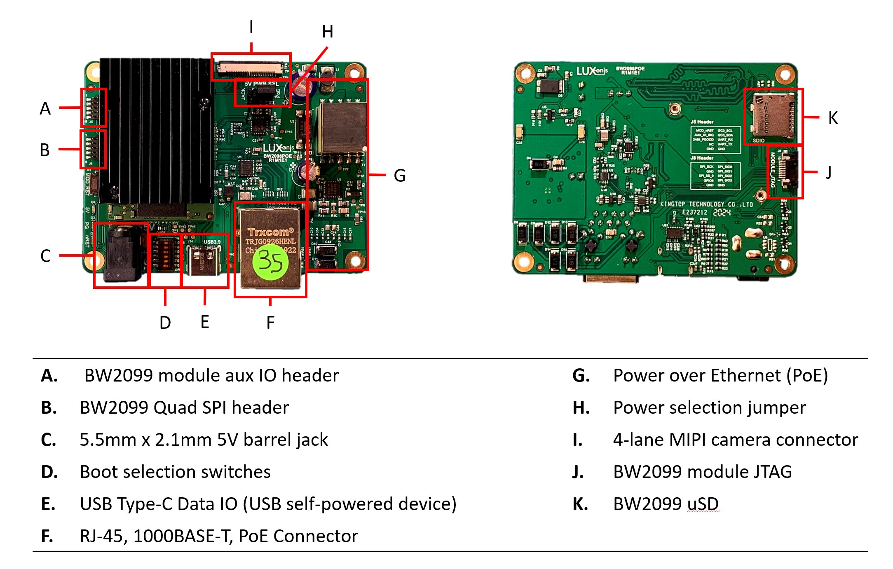

# OAK-FFC-1P-PoE

[Documentation here](https://docs.luxonis.com/projects/hardware/en/latest/pages/BW2098POE.html)

# Overview

This repository contains open hardware designed by Luxonis, and meant to be used as a baseboard for the [Luxonis](https://www.luxonis.com/depthai) [OAK-SOM-PRO](https://docs.luxonis.com/projects/hardware/en/latest/pages/BW2099.html). The BW2098POE baseboard offers full 802.3af, Class 3 PoE compliance with 1000BASE-T speeds, along with user-selectable external power from a 5V barrel jack. The Luxonis BW0249 12MP RGB camera module can be connected via the 26-pin FFC interface, which exposes a 4-lane MIPI CSI-2 channel directly into the Myriad X on the OAK-SOM-PRO module for processing. Data can also be streamed to a host via USB 3.1 Gen1 (Type-C). Finally, the BW2098POE board exposes boot selection switches, allowing the end user to boot the OAK-SOM-PRO module from USB or the on-board eMMC or NOR flash. 

## Repository structure:
* `PCB` contains the packaged Altium project files
* `Docs` contains project output files
* `Images` contains graphics for readme and reference
* `3D Models` contains generated 3D models of the board
* `Mechanical` contains models of mounts, enclosures, and other mechanical parts

# Key features
* Support Luxonis BW0249 12MP RGB camera module
* Interface for Luxonis 2099 SoM
* USB 3.1 Gen1 Type-C
* User-selectable power source from barrel jack or Power-over-Ethernet (PoE)
* 1000BASE-T ethernet 
* Header access for 2099 SoM 1.8V SPI
* Header access for 2099 SoM 1.8V Aux Signals (I2C, UART, GPIO) 
* Micro SD connector for OAK SoM 3.3V SDIO
* On-board PCIe ref clk for OAK-SOM-PRO and PCIe/Ethernet bridge
* User-selectable OAK-SOM-PRO boot configuration switches
* Design files produced with Altium Designer 20

# Board layout & dimensions

# Getting started
The BW2098POE accepts power input either from a 5.5m x 2.1mm barrel jack (5V +/-10%) or from the RJ-45 connector upstream from the 802.3af, Class 3 PoE circuitry. A jumper near the MIPI FFC connector allows for user selection of the input power source. Booting can be accomplished from either the USB interface or from the eMMC or NOR flash on the OAK-SOM-PRO, and boot selection is configured with the DIP switch bank near the barrel jack connector. With the BW0249 camera and the DepthAI OAK-SOM-PRO running inference, power consumption is typically 3.3W. 

Interfacing with the OAK SoM is also possible with BW2098POE connector pads J5 and J8, which expose OAK-SOM-PRO auxiliary IO and OAK-SOM-PRO Quad SPI, respectively. These headers are [Amphenol/FCI 20021121-00010T1LF](https://octopart.com/20021121-00010t1lf-amphenol+icc+%2F+fci-93112650?r=sp) or equivalent. Please refer to the schematics for pinout information.

The reset button resets the Luxonis DepthAI OAK-SOM-PRO only.

The 5V LED indicates 5V power is present on the BW2098POE. The PG LED indicates "power good" from the DepthAI OAK-SOM-PRO. The "RUN" LED indicates that the OAK SoM is not in reset.

**Caution should be taken when handling any PoE circuit board. Do not directly touch the circuitry as potentials up to and exceeding 57V may exist. Always use electronics handling best practices.** 

# Revision info
The desigs files represent the R3M1E3 revision of this project, though some photos may be of ealier revisions. Please refer to schematic page, `Project_Information.SchDoc` for full details of revision history.
