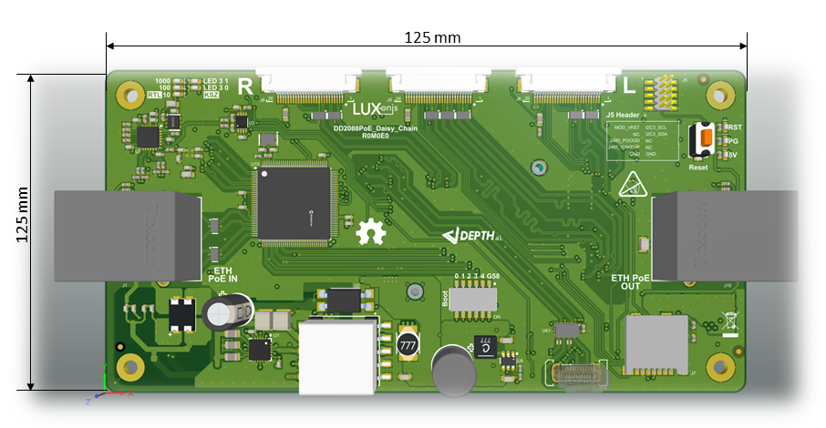
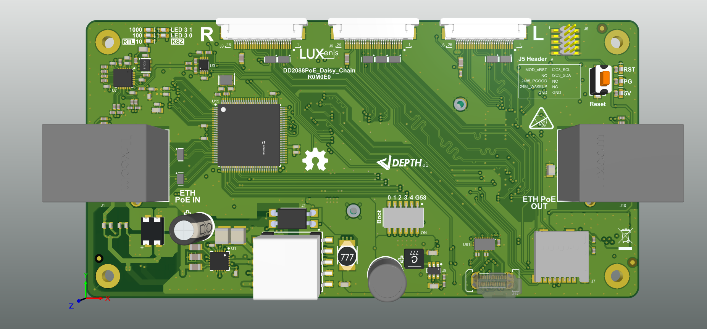

# OAK-D-POE daisy chain  (DD2088POE-DaisyChain)

# Project Stage
Hardware is now fully tested and ready for use. 

# Overview

This repository contains open hardware design, meant to be used as a baseboard for the [Luxonis](https://www.luxonis.com/depthai) BW2099 OAK SoM. The DD2088POE-DaisyChain baseboard offers full 802.3af, Class 3 PoE compliance with 1000BASE-T speeds, allowing for both PoE input and output as well as direct connection with other PoE network. The DD2088POE-DaisyChain baseboard has three FFC 26-pin connector ports for Gen2 cameras, which allow for two 2-lane MIPI camera modules i.e. [DM0250TG](https://github.com/luxonis/depthai-hardware/tree/master/DM0250TG_DepthAI_Mono_Camera/R1M1E1) (stereo pair) and one [DM0249](https://github.com/luxonis/depthai-hardware/tree/master/DM0249_DepthAI_RGB_Camera/R1M1E1) RGB camera module. That implements stereo and RGB vision, piped directly into the OAK SoM for depth and AI processing. The data is then output to a host via USB 3.1 Gen1 (Type-C) or via 1000BASE-T ethernet connection. 
The DD2088POE-DaisyChain board exposes boot selection switches, allowing the end user to boot the BW2099 module from USB or the on-board eMMC or NOR flash. 

## Repository structure:
* `PCB` contains the packaged Altium project files
* `Docs` contains project output files
* `Images` contains graphics for readme and reference
* `3D Models` contains generated 3D models of the board
* `Mechanical` contains models of mounts, enclosures, and other mechanical parts

# Key features
* Support for FFC Gen2 and Arducam OAK camera modules
* Interface for Luxonis 2099 SoM
* USB 3.1 Gen1 Type-C
* Passthrough Power-over-Ethernet (PoE) power source
* 1000BASE-T ethernet for data
* BNO085/86 IMU 
* Header access for 2099 SoM 1.8V Aux Signals (I2C, , Module Reset) 
* Micro SD connector for OAK SoM 3.3V SDIO
* On-board PCIe ref clk for BW2099, PCIe/Ethernet bridge and Gigabit Ethernet Switch
* User-selectable BW2099 boot configuration switches
* Design files produced with Altium Designer 20

# Board layout & dimensions

# Getting started
The DD2088POE-DaisyChain accepts power input from any 802.3af, Class 3 PoE circuitry and passes through the board both power pairs.  So this so this device can be powered from any/every POE UniFi Switch (e.g. [US-8-150W](https://www.ui.com/unifi-switching/unifi-switch-8-150w/)) and any other standard POE switch and/or 802.3af POE injector (e.g. [here](https://www.amazon.com/Injector-U-POE-af-802-3af-Supported-Ethernet/dp/B07SH2NM9F/ref=sr_1_3?dchild=1&keywords=ubiquiti+48v+poe+injector&qid=1614832809&sr=8-3)).   Power consumption is typically 5W, per device leaving ~7.5W available if active lighting is desired additionally over POE/etc.  

Interfacing with the OAK SoM is also possible with DD2088POE-DaisyChain connector pads J5 which expose BW2099 auxiliary IO. This header is [Amphenol/FCI 20021121-00010T1LF](https://octopart.com/20021121-00010t1lf-amphenol+icc+%2F+fci-93112650?r=sp) or equivalent. Please refer to the schematics for pinout information.

The reset button resets the Luxonis DepthAI BW2099 SoM only.   
The 5V LED indicates 5V power is present on the DD2088POE-DaisyChain.   
The PG LED indicates "power good" from the DepthAI BW2099 SoM.   
The "RUN" LED indicates that the OAK SoM is not in reset.  

**Caution should be taken when handling any PoE circuit board. Do not directly touch the circuitry as potentials up to and exceeding 57V may exist. Always use electronics handling best practices.** 

# Design Revision info
The design files represent the R0M0E0 revision of this project. Please refer to schematic page, `Project_Information.SchDoc` for full details of revision history.
