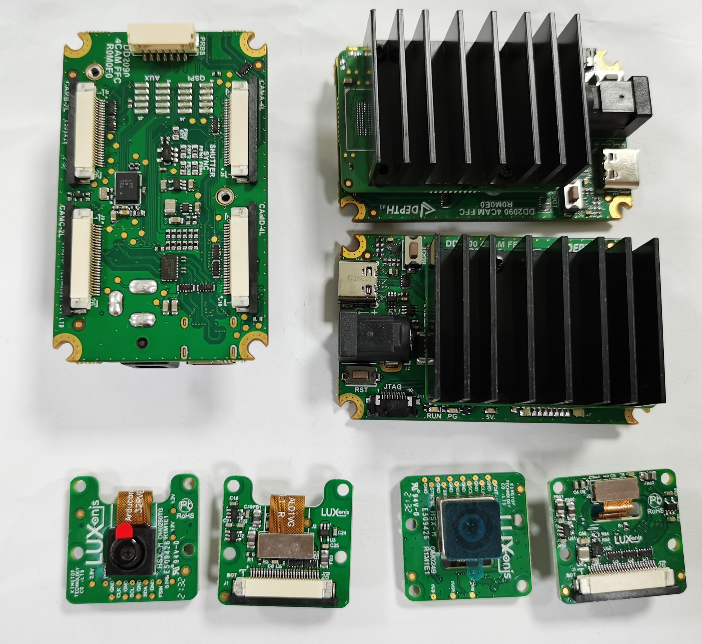
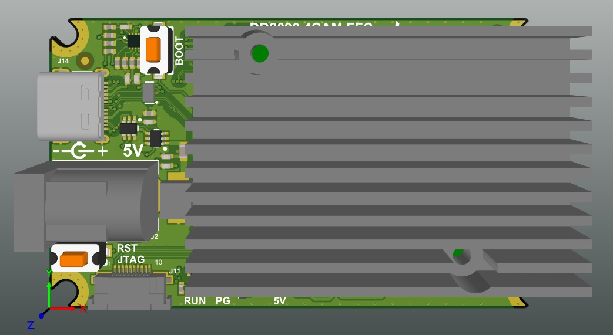
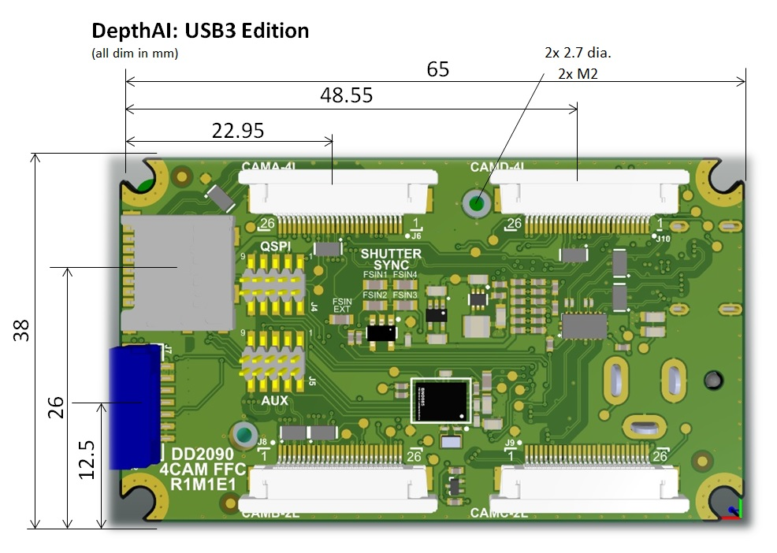

# DD2090FFC DepthAI USB3 Edition (WIP)

DD2090FFC + [DM0250TG](https://github.com/luxonis/depthai-hardware/tree/master/DM0250TG_DepthAI_Mono_Camera) + [DM0249](https://github.com/luxonis/depthai-hardware/tree/master/DM0249_DepthAI_RGB_Camera) are shown together below:

# Project Stage (WIP)

This design is WIP and will be updated when design is finished and sent out for prototyping.

**FFC reference design DM1090FFC with support for 3 cameras is located [here](https://github.com/luxonis/depthai-hardware/tree/master/DM1090FFC_DepthAI_USB3) .**   

# Overview

This repository contains open hardware designed by Luxonis, and meant to be used as a baseboard for the [Luxonis](https://www.luxonis.com/) [OAK-SOM](https://docs.luxonis.com/projects/hardware/en/latest/pages/BW1099.html). The DD2090FFC baseboard has four FFC interfaces which allow for two [DM0250TG](https://github.com/luxonis/depthai-hardware/tree/master/DM0250TG_DepthAI_Mono_Camera)  (R1M1E1 or newer) camera modules (stereo pair) and two [DM0249](https://github.com/luxonis/depthai-hardware/tree/master/DM0249_DepthAI_RGB_Camera) (R1M1E1 or newer) RGB camera module. 

# Repository structure:
* `PCB` contains the packaged Altium project files
* `Docs` contains project output files
* `Images` contains graphics for readme and reference
* `3D Models` contains generated 3D models of the board
# Key features
* 2x DM0250TG mono camera module interfaces
* 2x DM0249 RGB camera module interface
* 5V power input via barrel jack
* USB 3.1 Gen 1 Type-C
* IMU support
* uSD card slot
* Onboard EEPROM
* Pads for DepthAI SoM 1.8V SPI
* Pads for DepthAI SoM 1.8V Aux Signals (I2C, UART, GPIO)
* PRBS connector (RST, BOOT_SEL, AUX_GPIO, 5V)
* Design files produced with Altium Designer 20

# Board layout & dimensions

# Getting started  

The DD2090FFC accepts 5V (+/-10%) from a 5.5m x 2.5mm barrel jack, and interfaces to a host via USB 3.1 Gen1 Type-C. With cameras and the DepthAI SoM, total power consumption usually stays below the 900ma specification of USB 3, but Type-C power of 1.5A or greater is recommended. 

Interfacing with the DepthAI SoM is also possible with DD2090FFC connector pads J4, and J5. These pads are designed for the [Amphenol/FCI 20021121-00010T1LF](https://octopart.com/20021121-00010t1lf-amphenol+icc+%2F+fci-93112650?r=sp) or equivalent. Please refer to the schematics for pinout information. 

The reset button resets the Luxonis DepthAI SoM only. 

The 5V LED indicates 5V power is present on the DD2090FFC. The PG LED indicates "power good" from the DepthAI SoM. The "RUN" LED indicates that the DepthAI SoM is not in reset.

# Revision info

These files represent the R1M1E1 revision of this project. Please refer to a schematic page, `Project_Information.SchDoc` for full details of revision history. This design is a WIP and will be updated once received and fully vetted.

# Camera Usage

This board is compatible with the  [DM0249](https://github.com/luxonis/depthai-hardware/tree/master/DM0249_DepthAI_RGB_Camera), connected to the `CAMA-4L`and/or `CAMD-4L` FFC port and [DM0250TG](https://github.com/luxonis/depthai-hardware/tree/master/DM0250TG_DepthAI_Mono_Camera), connected to the `CAMB_2L` and/or `CAMC_2L` port.

