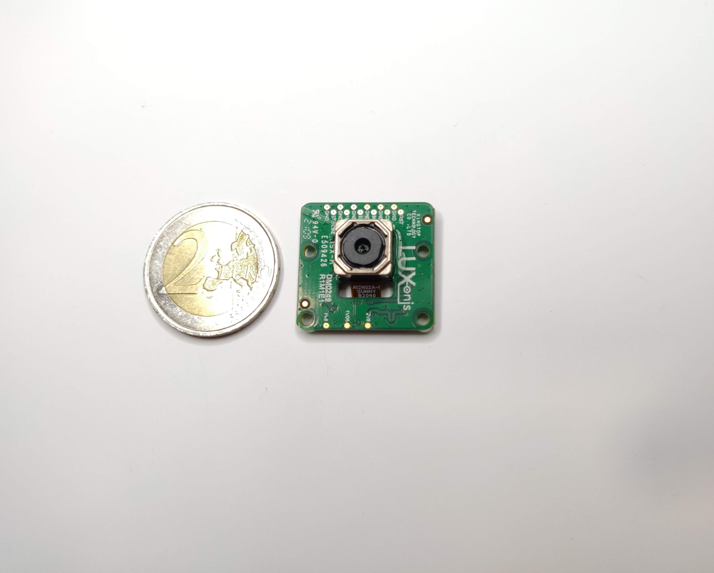

# DM0249 RGB Camera Module

# Project Stage
**Caution: This project is still under development. We are currently in process of getting our board prototyped and tested.** 
           **We are proactively making our design available for our uses to plan and provide us with design feedback.** 

# Overview
This repository contains open hardware designed by Luxonis. The DM0249_R1M1E1 is a carrier board for the Sunny A12N02A IMX378 camera module, and is designed to be compatible with new version of FFC base boards which is [DM1090FFC](https://github.com/luxonis/depthai-hardware/tree/master/DM1090FFC_DepthAI_USB3). 
In this version of 0249 carrier board no outer dimensions or mounting holes were changed. Reason for change was having same 26-pin FFC pinout on all camera connectors and being able to attach cameras with 22pin RPi pinout to DM1090FFC with use of custom FFC from Arducam.

# Repository structure:
* `PCB` contains the packaged Altium project files
* `Docs` contains project output files
* `Images` contains graphics for readme and reference
* `3D Models` contains generated 3D models of the board
# Key features
* 26 pin 0.5mm FFC interconnect to baseboard
* 30 pin interface to IMX378 camera module
* 4-lane MIPI
* Aux/Control signals to camera module
* 5V power input via FFC
* On-board power generation for camera module
* Design files produced with Altium Designer 20

# Board layout & dimensions 

# Getting started  
Camera module compatibility is known for the Sunny A12N02A, but not tested for other modules. The FFC connector is an 0.5mm pitch, 26-pin, and bottom-contact, across which travels the 4-lane MIPI, 3.3V, I2C, camera clock, camera reset, and other optional control lines. 3.3V power is regulated down and filtered as appropriate to meet the requirements of the compact camera module and IMX378.  

# Revision info
These files represent the R1M1E1 revision of this project. Please refer to schematic page, `Project_Information.SchDoc` for full details of revision history.