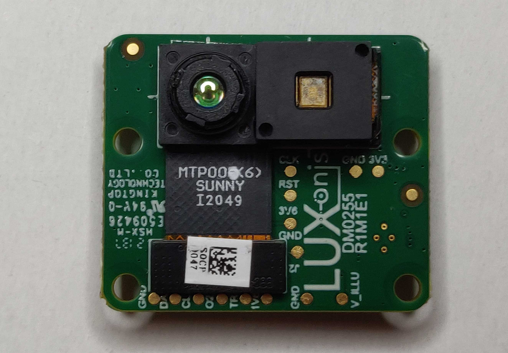
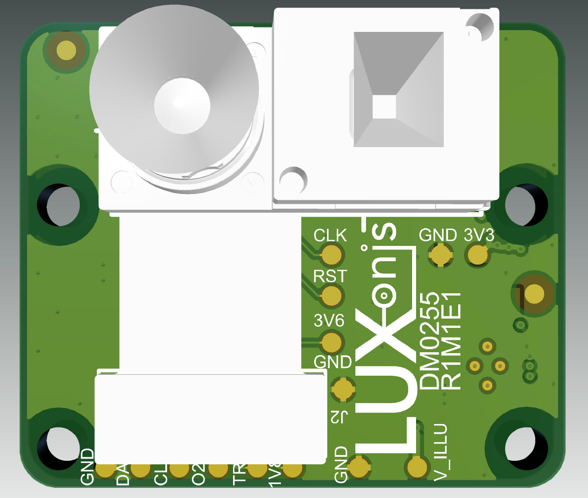

# DM0255 Mono Camera Module

# Project Stage

**This project is now tested and prototypes are now vetted.** 

# Overview
This repository contains open hardware designed by Luxonis. The DM0255_R1M1E1 is a carrier board for the Sunny MTP006 pTOF camera module, and is designed to be compatible with new version of FFC base boards which is [DM1090FFC](https://github.com/luxonis/depthai-hardware/tree/master/DM1090FFC_DepthAI_USB3). A single DM0255 is typically used instead of a RGB camera.
In this version of 0255 carrier board the whole size had to be bigger than other camera boards we offer, so that we were able to locate the MTP006 module on the Camera Board Assembly (CBA). Reason for the change from previous revision (R0M0E0) was having same 26-pin FFC pinout on all camera connectors boards and using same connecting interface over all FFC camera boards.

# Repository structure:
* `PCB` contains the packaged Altium project files
* `Docs` contains project output files
* `Images` contains graphics for readme and reference
* `3D Models` contains generated mechanical models for the board

# Key features
* 26 pin 0.5mm FFC interconnect to baseboard
* 33 pin interface to MTP006 camera module
* 2-lane MIPI
* Aux/Control signals to camera module
* 3.3V power input via FFC
* On-board power generation for camera module
* Design files produced with Altium Designer 21

# Board layout & dimensions

# Getting started  
The FFC interface is an 0.5mm pitch, 26-pin, and bottom-contact connector, across which travels the 2-lane MIPI, 3.3V, I2C, camera clock, camera reset, and other optional control lines. 3.3V power is regulated and filtered as appropriate to meet the requirements of the MTP006 camera module. 
For now the CBA must be used with RGB/CENTER camera port on the OAK-FFC-3p, support to use it with CAM_L or CAM_R will be added soon.    

# Revision info
These files represent the R1M1E1 revision of this project. Please refer to schematic page, `Project_Information.SchDoc` for full details of revision history.
