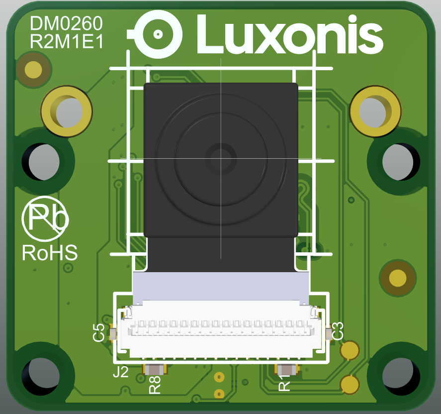
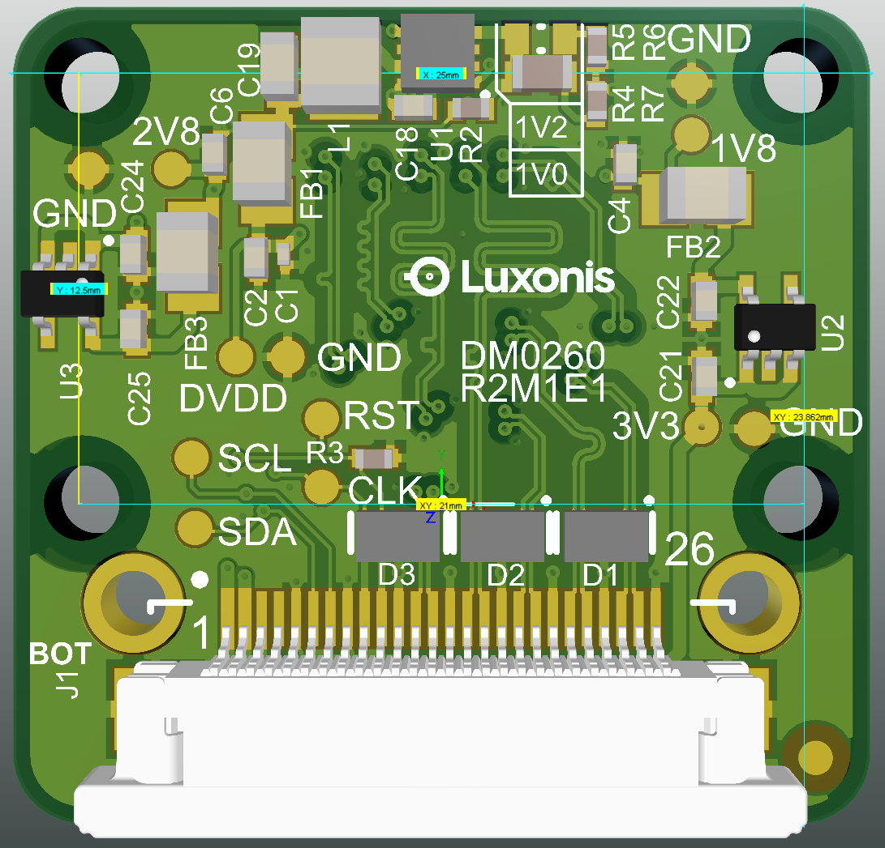
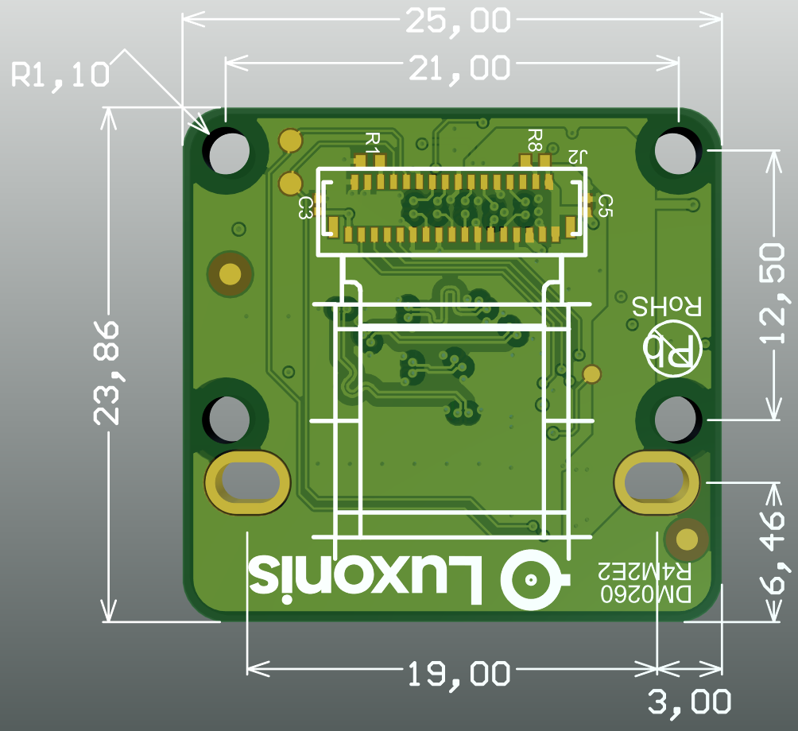
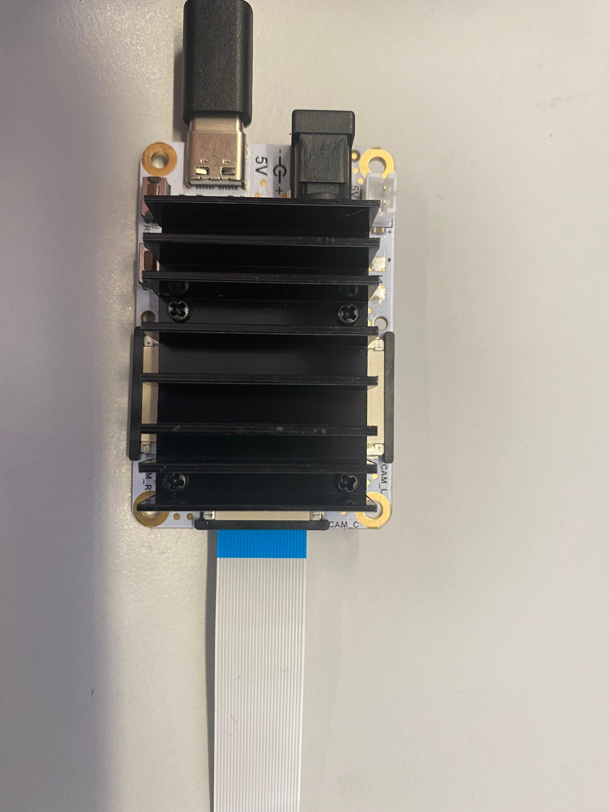

# DM0260_R2M1E1 Camera Board Assembly

[Documentation here](https://docs.luxonis.com/projects/hardware/en/latest/pages/ffc-cameras/)

 

# Overview
This repository contains open hardware designed by Luxonis. The DM0260 is a carrier board for the ArduCam camera modules and is designed to be compatible with all [Modular Cameras](https://docs.luxonis.com/projects/hardware/en/latest/#modular-camera-designs): OAK-FFC 3P, OAK-FFC 4P, OAK-FFC 4P PoE and (more to come).

The advantage of this new OAK-FFC-CBA design is that it can support various Compact Camera Modules from ArduCam which are interfacing over standard 33-pin camera FPC. Supported cameras are listed [here](https://docs.luxonis.com/hardware/platform/sensors/ccms/), it also supports M12 lens mount.    

# Repository structure:
* `PCB` contains the packaged Altium project files
* `Docs` contains project output files
* `Images` contains graphics for readme and reference
* `3D Models` contains generated mechanical models for the board

# Key features
* 26 pin 0.5mm FFC interconnect to baseboard
* 33 pin interface supporting various camera modules from ArduCam
* 4-lane MIPI
* Aux/Control signals to camera module
* 3V3 power input via FFC
* On-board power generation for camera modules (two assembly variants covering all supported sensors in Luxonis products)
* Support for M12 lens mount
* Design files produced with Altium Designer 24

# Board layout & dimensions

Board outline is the same as for older versions of FFC **C**amera **B**oard **A**ssemblies so the dimensions are consequentially the same. 

Board layout designed in Altium designer can be found in the PCB subfolder.  

All dimensions are in millimeters.

# Getting started  
The 0.5mm pitch, 26-pin 15cm long FFC is included with each camera that is sold by Luxonis or any of its legal distributors. We are using a bottom-contact connector on all our Modular camera boards. The correct connection can be seen on below photos, please note the blue section on the FPC for correct orientation: 

 

# Revision info
These files represent the R4M2E2 revision of this project. Please refer to schematic page, `Project_Information.SchDoc` for full details of revision history.
