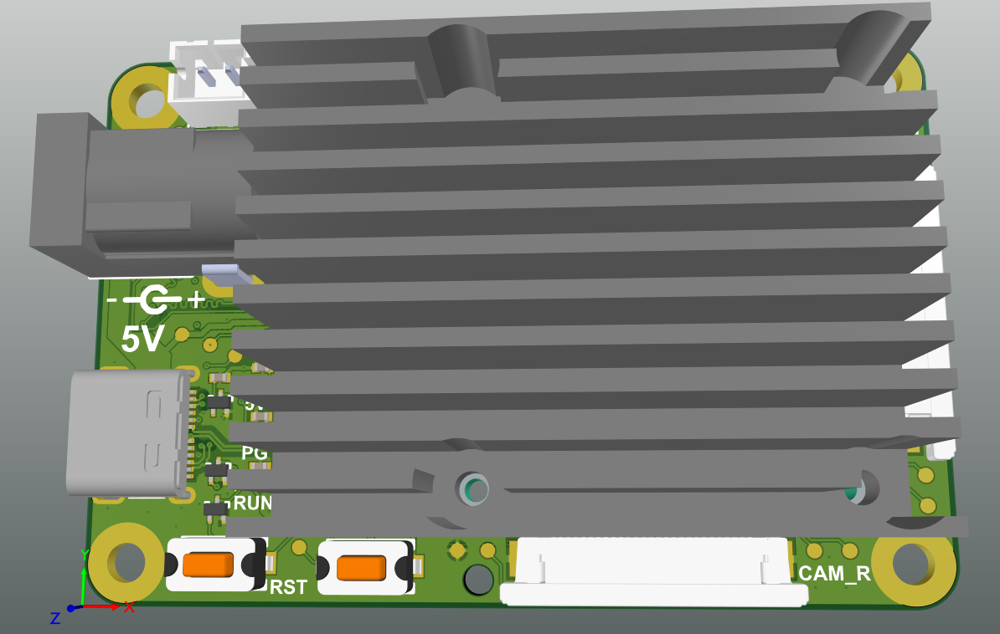
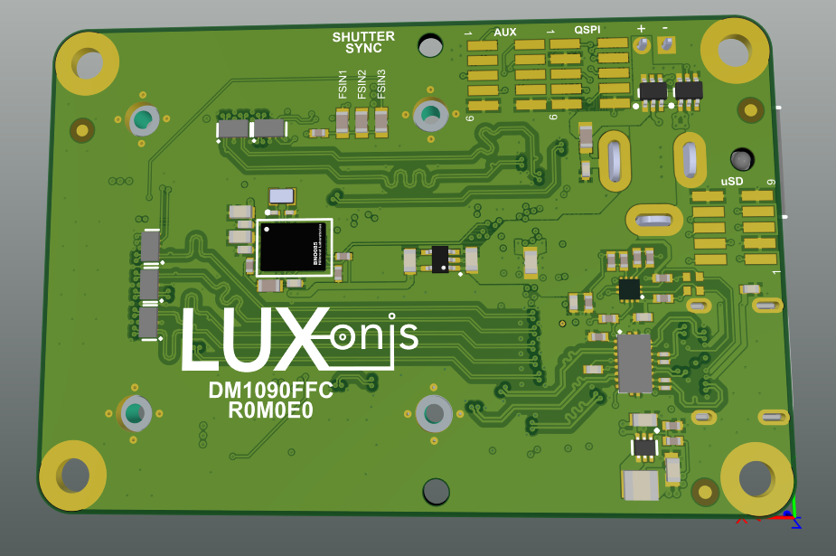

# DM1090FFC_R0M0E0 DepthAI USB3 Edition

DM1090FFC + [DM0250TG](https://github.com/luxonis/depthai-hardware/tree/master/DM0250TG_DepthAI_Mono_Camera/R1M1E1) + [DM0249](https://github.com/luxonis/depthai-hardware/tree/master/DM0249_DepthAI_RGB_Camera/R1M1E1) are shown together below:

# Project Stage

**Caution: This project is still under development. We are currently in process of getting our board prototyped and tested.** 
           **We are proactively making our design available for our uses to plan and provide us with design feedback.** 

# Overview
This repository contains open hardware designed by Luxonis, and meant to be used as a baseboard for the [Luxonis](https://www.luxonis.com/depthai) BW1099 DepthAI SoM. The DM1090FFC baseboard has three FFC interfaces which allow for two 2-lane MIPI camera modules i.e. [DM0250TG](https://github.com/luxonis/depthai-hardware/tree/master/DM0250TG_DepthAI_Mono_Camera/R1M1E1) (stereo pair) and one [DM0249](https://github.com/luxonis/depthai-hardware/tree/master/DM0249_DepthAI_RGB_Camera/R1M1E1) RGB camera module. There is also a chance to connect three 2-lane MIPI camera modules i.e. [DM0250TG](https://github.com/luxonis/depthai-hardware/tree/master/DM0250TG_DepthAI_Mono_Camera/R1M1E1) if [DM0249](https://github.com/luxonis/depthai-hardware/tree/master/DM0249_DepthAI_RGB_Camera/R1M1E1) RGB camera module is not required.  

Please note that only revision R1M1E1 and newer camera modules can be connected to the 1090FFC. With DM1090FFC we gained support for 22-pin RPi camera interface. For that you will need a FFC from Arducam, which converts 26-pin Luxonis camera pinout to 22 pin RPi camera pinout. 

In addition IMU over SPI support was also added to the 1090FFC. 

# Repository structure:
* `PCB` contains the packaged Altium project files
* `Docs` contains project output files
* `Images` contains graphics for readme and reference
* `3D Models` contains generated 3D models of the board
# Key features
* 3x DM0250TG_R1M1E1 mono camera module interfaces or
* 2x DM0250TG_R1M1E1 and 1x DM0249_R1M1E1 RGB camera module interface
* 5V power input via barrel jack
* USB 3.1 Gen 1 Type-C
* Interface for Luxnois BW1099 DepthAI SoM
* Pads for DepthAI SoM 1.8V SPI
* Pads for DepthAI SoM 3.3V SDIO 
* Pads for DepthAI SoM 1.8V Aux Signals (I2C, UART, GPIO)
* 5V Fan OR USB Type-C 
* Design files produced with Altium Designer 20

# Board layout & dimensions

# Getting started  

The DM1090FFC  is powered via USB Type-C or from a 5V, 5.5m x 2.5mm barrel jack, and interfaces to a host via USB 3.1 Gen1 Type-C. With cameras and the DepthAI SoM, total power consumption usually stays below the 900ma specification of USB 3, but Type-C power of 1.5A or greater is recommended. 

Interfacing with the DepthAI SoM is also possible with DM1090FFC connector pads J3, J4, and J5. These pads are designed for the [Amphenol/FCI 20021121-00010T1LF](https://octopart.com/20021121-00010t1lf-amphenol+icc+%2F+fci-93112650?r=sp) or equivalent. Please refer to the schematics for pinout information. 

The reset button resets the Luxonis DepthAI SoM only. The boot button overrides boot mode to USB boot if different boot mode is set in NOR Flash and 1099EMB SoM is used.

The 5V LED indicates 5V power is present on the DM1090FFC. The PG LED indicates "power good" from the DepthAI SoM. The "RUN" LED indicates that the DepthAI SoM is not in reset.

# Revision info

These files represent the R0M0E0 revision of this project. Please refer to schematic page, `Project_Information.SchDoc` for full details of revision history.

# Camera Usage

This board is compatible with the  [DM0249_R1M1E1](https://github.com/luxonis/depthai-hardware/tree/master/DM0249_DepthAI_RGB_Camera/R1M1E1), connected to the `RGB` FFC port and [DM0250TG_R1M1E1](https://github.com/luxonis/depthai-hardware/tree/master/DM0250TG_DepthAI_Mono_Camera/R1M1E1), connected to the `CAM_L` and/or `CAM_R` and/or `RGB`port.

This board support the Raspberry Pi 22-pin camera interface , using the custom 26-pin to 22-pin FFC  from Arducam.

