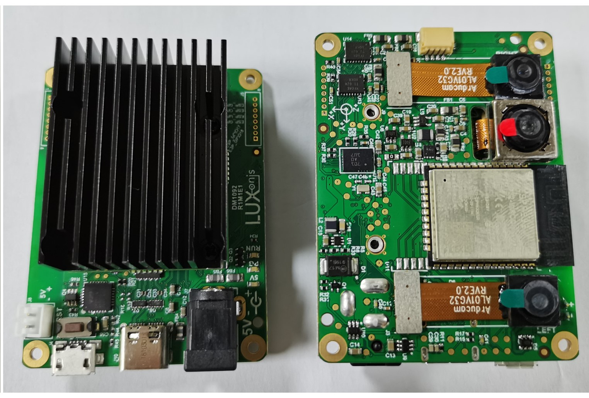
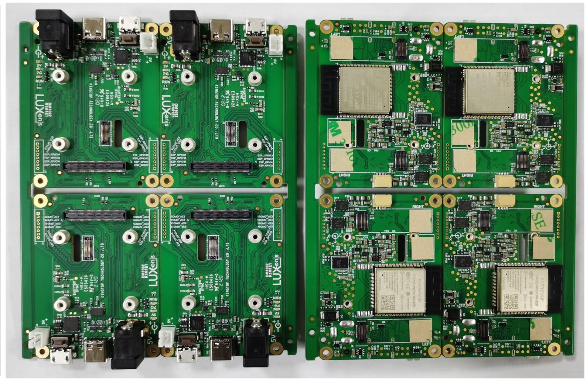

# DM1092: Embedded DepthAI Reference Design with Onboard ESP32 for WiFi and BT 

# Project Stage
**Caution: This project is still under development. We are currently in process of getting our board prototyped and tested.** 
           **We are proactively making our design available for our uses to plan and provide us with design feedback.** 

With this revision the IMU issue is fixed, now connected over SPI. 

# Getting started
The DM1092 accepts power input from 5V barrel jack and it can also accept power from USB C connector. Booting can be accomplished from either the ESP32 or NOR flash on the OAK-SOM-IoT, boot selection is configured on OAK-SOM-IoT with BOOT resistors. 

The reset button resets the Luxonis DepthAI OAK-SOM-IoT only.
The 5V LED indicates 5V power is present on the DM1092.
The PG LED indicates "power good" from the DepthAI OAK-SOM-IoT.
The "RUN" LED indicates that the DepthAI SoM is not reset.

# Design Revision info
The design files represent the R2M2E2 revision of this project. Please refer to a schematic page, `Project_Information.SchDoc` for full details of revision history.

# Overview:

This design is one of two baseboards for the DepthAI: System on Module (SoM) - Embedded Variant ([OAK-SOM-IoT](https://shop.luxonis.com/collections/all/products/bw1099emb)).

To read more on the `why` of this design, see https://github.com/luxonis/depthai-hardware/issues/10 and https://github.com/luxonis/depthai-hardware/issues/9.

This design will serve (once complete and errata corrected) as a reference for multiple purposes:
 - How to use the OAK-SOM-IoT with microcontrollers over SPI
 - How to connect DepthAI as an IoT device to AWS-IoT
 - How to use DepthAI without an OS-capable host processor (e.g. with an embedded microcontroller like the ESP32)
 - How to use DepthAI with WiFi and BT
 - Prototype of DepthAI with an integrated IMU 

