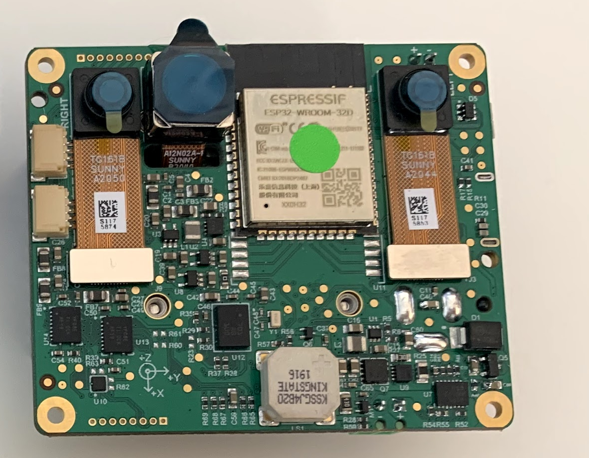

# DM1092_LiPo: Embedded DepthAI Reference Design with Onboard ESP32 for WiFi and BT battery powered [WIP]

# Project Stage
**Caution: This project is still under development. We are currently in process of getting our board tested.** 
           **We are proactively making our design available for our uses to plan and provide us with design feedback.** 

# Getting started
The DM1092_LiPo accepts power input from 5V barrel jack and it can also accept power from USB C connector. Besides getting powered in a regular way as it is the case for all other base boards this LiPo version also features powering from any LiPo/Li-Ion battery with charge voltage set to 4.2V. We use 10 000 mAh LiPo battery which is connected to a screw-type connector. Battery can be charged either from barrel jack (charging current 1.52A) or from USB C (charging current 1.21A), DM1092_LiPo can be used while charging.  

Board supports all functions from its predecessor BW1092, in addition a LiPo battery BMS, buzzer and power switch were added. Buzzer can be used for alarming and power switch is integrated to power off SoM and all other unused power islands (cameras) besides ESP32 3.3V supply rail in order to get lowest possible consumption in low power battery applications. Only ESP32 has control over power switch. For standalone mode booting can be accomplished from either the ESP32 or NOR flash on the BW1099EMB, boot selection is configured on BW1099EMB with BOOT resistors. 

The reset button resets the Luxonis DepthAI BW1099EMB SoM only.   
The 5V LED indicates 5V power is present on the DM1092.   
The PG LED indicates "power good" from the DepthAI BW1099EMB SoM.   
The "RUN" LED indicates that the DepthAI SoM is not reset.     
The "LiPo CHGR" LED indicates that the battery is being charged.  

# Design Revision info
The design files represent the R0M0E0 revision of this project. Please refer to a schematic page, `Project_Information.SchDoc` for full details of revision history.

# Overview:

This design is one of two baseboards types for the DepthAI: System on Module (SoM) - Embedded Variant ([BW1099EMB](https://shop.luxonis.com/collections/all/products/bw1099emb)).

To read more on the `why` of this design, see https://github.com/luxonis/depthai-hardware/issues/10 and https://github.com/luxonis/depthai-hardware/issues/9.

This design will serve (once complete and errata corrected) as a reference for multiple purposes:
 - How to use the BW1099EMB with microcontrollers over SPI

 - How to connect DepthAI as an IoT device to AWS-IoT

 - How to use DepthAI without an OS-capable host processor (e.g. with an embedded microcontroller like the ESP32)

 - How to use DepthAI with WiFi and BT

 - Prototype of DepthAI with an integrated IMU 
 

 
 
 
 
 
 
 
 And size reference (compared to BW1098OAK USB3C):
 

