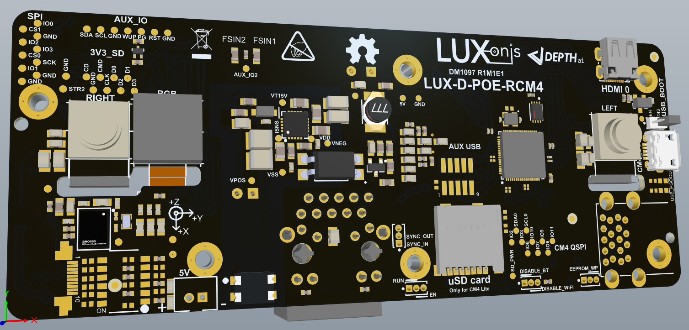
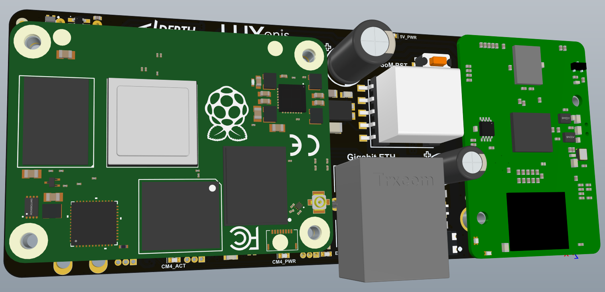
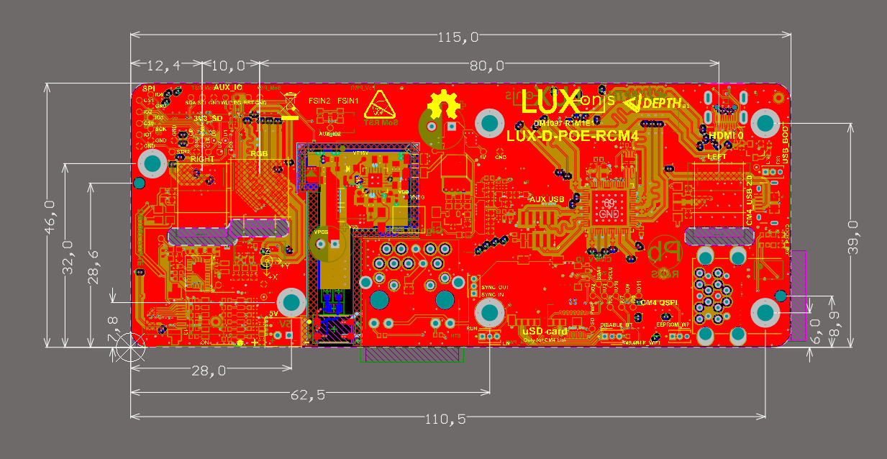
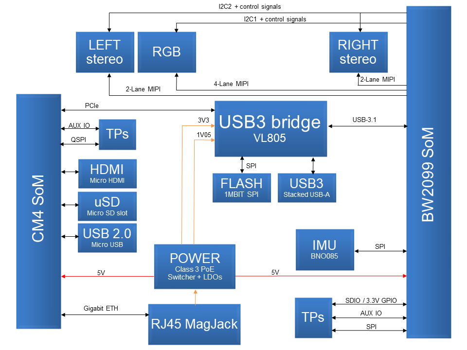

# DM1097_R1M1E1 DepthAI for Compute module 4 USB3, PoE, IMU, enclosure...

# Project Stage
This design is WIP and will be confirmed when first prototypes are tested. 

# Overview
This repository contains open hardware designed by Luxonis, and meant to be used as a baseboard for the [Luxonis](https://www.luxonis.com/depthai) BW2099 DepthAI SoM and the [Raspberry Pi Compute Module 4](https://www.raspberrypi.org/products/compute-module-4/?variant=raspberry-pi-cm4001000). 

Based on the BW1097 and Raspberry PI CM4IO board, the DM1097 combines a host and the Luxonis DepthAI SoM to allow for a fully integrated solution for real-time spatial AI. 

This design will integrate PoE, IMU, prebuilt for enclosure, UBS3, connectors for developing and debugging which won't be populated in production later.  

# Repository structure:
* `PCB` contains the packaged Altium project files
* `Docs` contains project output files
* `Images` contains graphics for readme and reference
* `3D Models` contains generated 3D models of the board
* `Mechanical` contains models of mounts, enclosures, and other mechanical parts 

# Key features
* Support for onboard stereo and RGB camera modules
* Interface for Luxonis DepthAI SoM 2099
* Interface for Raspberry PI CM4/CM4 Lite
* USB3 interface between CM4 and DepthAI SoM
* 2x USB3 (for development purpose only, stacked connector not populated in production)
* 1x Aux USB3 (pads designed for the [Amphenol/FCI 20021121-00010T1LF](https://octopart.com/20021121-00010t1lf-amphenol+icc+%2F+fci-93112650?r=sp) or equivalent. )
* Gigabit Ethernet connected directly to CM4
* Raspberry PI USB boot option (micro USB2)
* Micro HDMI output
* Support for 5V fan or Aux supply
* PoE supply integrated on board 
* microSD card support for CM4 SoM
* Design files produced with Altium Designer 20

# Board layout & dimensions

We have tried to keep the size of the PCB as small as possible and removed the unnecessary ports for enclosed device, that were previously used on 1097 boards. 

# Getting started

The DM1097_R1 can be powered from any 802.3af, Class 3 PoE circuitry.  So this for example includes any/every POE UniFi Switch (e.g. [US-8-150W](https://www.ui.com/unifi-switching/unifi-switch-8-150w/)) and any other standard POE switch and/or 802.3af POE injector (e.g. [here](https://www.amazon.com/Injector-U-POE-af-802-3af-Supported-Ethernet/dp/B07SH2NM9F/ref=sr_1_3?dchild=1&keywords=ubiquiti+48v+poe+injector&qid=1614832809&sr=8-3)).  

Interfacing with the DepthAI SoM is also possible with test point pads marked accordingly to the interface they are exposing (AUX_IO, 3V3_SD_GPIOs, 1V8_SPI).

Below you can see a top level DM1097_R1M1E1 block diagram:

The reset button resets the Luxonis DepthAI BW2099 SoM only.  
The "5V_PWR" LED indicates 5V power is present on the DM1097.  
The "SoM_PG" LED indicates "power good" from the DepthAI BW2099 SoM.   
The "SoM_RST" LED indicates that the DepthAI SoM is not in reset.  
The "CM4_ACT" LED indicates activity on CM4 module, same purpose as the green "ACT" LED on Raspberry Pi .   
The "CM4_PWR" LED indicates that the power to the CM4 SoM is delivered.  

**Caution should be taken when handling any PoE circuit board. Do not directly touch the circuitry as potentials up to and exceeding 57V may exist. Always use electronics handling best practices.** 

# Revision info
These files represent the R1M1E1 revision of this project. Please refer to a schematic page, `Project_Information.SchDoc` for full details of revision history. This design is sent out to the manufacturer and we are waiting to receive first prototypes.  