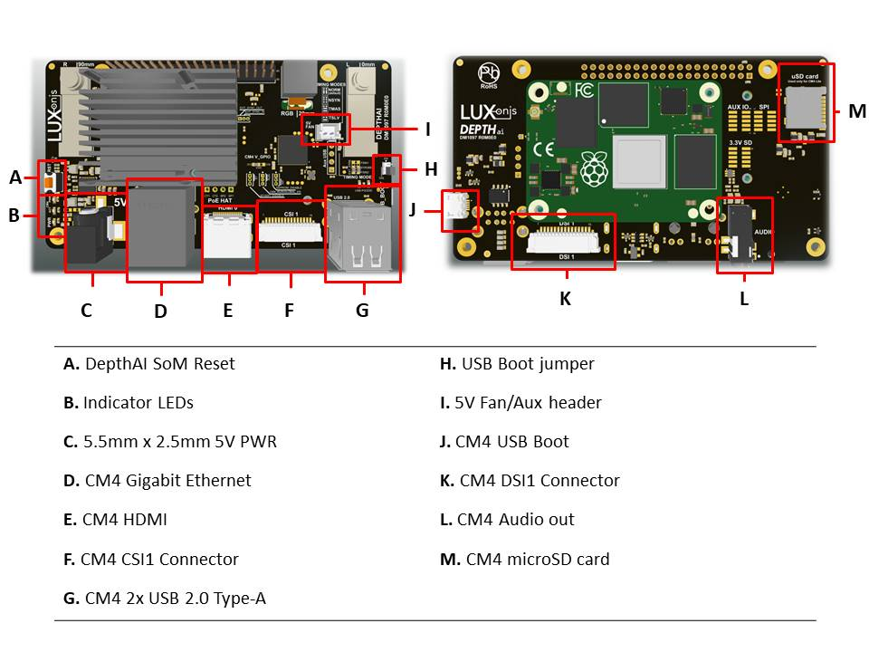

# DM1097_R0M0E0 DepthAI for Compute module 4

# Project Stage
**Caution : This project is still under development. We are currently in process of getting our board prototyped and tested.** 
           **We are proactively making our design available for our uses to plan and provide us with design feedback.** 

# Overview
This repository contains open hardware designed by Luxonis, and meant to be used as a baseboard for the [Luxonis](https://www.luxonis.com/depthai) BW1099 DepthAI SoM and the [Raspberry Pi Compute Module 4](https://www.raspberrypi.org/products/compute-module-4/?variant=raspberry-pi-cm4001000). 

Based on the BW1097 and Raspberry PI CM4IO board, the DM1097 combines a host and the Luxonis DepthAI SoM to allow for a fully integrated solution for real-time spatial AI. 
The biggest difference in DM1097 and BW1097 architecture is that DM1097 integrates CM4 module, has gigabit ethernet, and populated with MagJack supporting POE. POE can be used with additional POE Hat.

# Repository structure:
* `PCB` contains the packaged Altium project files
* `Docs` contains project output files
* `Images` contains graphics for readme and reference
* `3D Models` contains generated 3D models of the board
* `Mechanical` contains models of mounts, enclosures, and other mechanical parts

# Key features
* Support for onboard stereo and RGB camera modules
* Interface for Luxnois DepthAI SoM
* Interface for Raspberry PI CM4/CM4 Lite
* USB2 interface between CM4 and DepthAI SoM
* 2x USB2
* 1x Aux USB2
* Gigabit Ethernet connected directly to CM4
* Raspberry PI CSI/DSI support
* Raspberry PI USB boot option
* Standard 40-pin header for CMIO/CM4 
* HDMI output
* 5V barrel jack input
* Support for 5V fan
* TRS Audio output
* microSD card support 
* Design files produced with Altium Designer 20

# Board layout & dimensions

# Getting started
The BW1097 accepts 5V (+/-10%) from a 5.5m x 2.5mm barrel jack. Raspberry PI USB boot can be accessed by setting a header jumper, which allows an initial flash of eMMC on CM4. Alternatively, the microSD slot can be used with a bootable system image. 

The reset button resets the Luxonis DepthAI SoM only. To reset the CM4/CM4 Lite, ground the `RUN` header via to the `GND` header via. To shutdown Bluetooth/WiFi, the `BT/WIFI_DISABLE` header can be used with `GND` on the center pin. To protect writing to EEPROM, gound `WP` header via to the `GND` header via. 

All those headers are not populated by default but can be added allowing those features. 

The PWR LED indicates "power good" for the BW1097 on-board PMIC. The CM4 ACT LED indicates activity on the CM4/CM4 Lite device and CM4 PWR indicates power on CM$/CM4 Lite. Other indicator LEDs exist for the two USB2.0 Type A ports and for the Gigabit Ethernet port. 

# Revision info
These files represent the R0M0E0 revision of this project. Please refer to a schematic page, `Project_Information.SchDoc` for full details of revision history.
