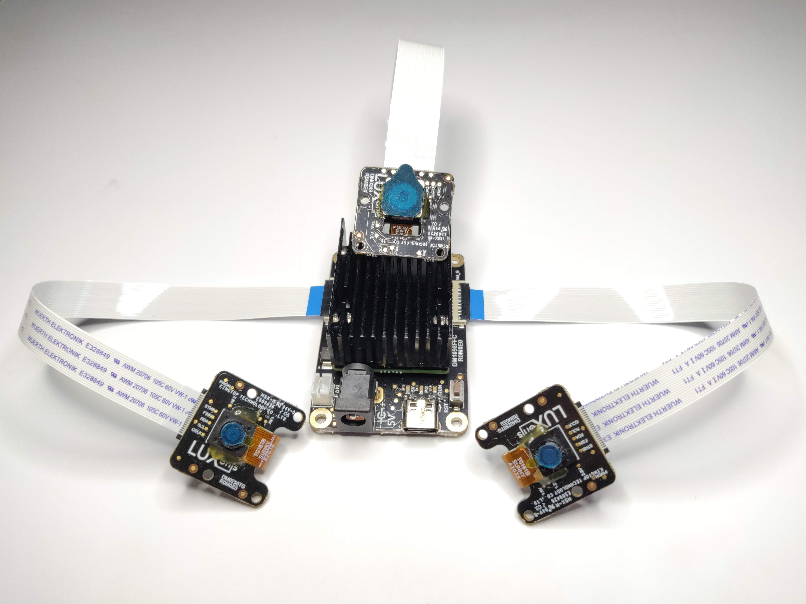
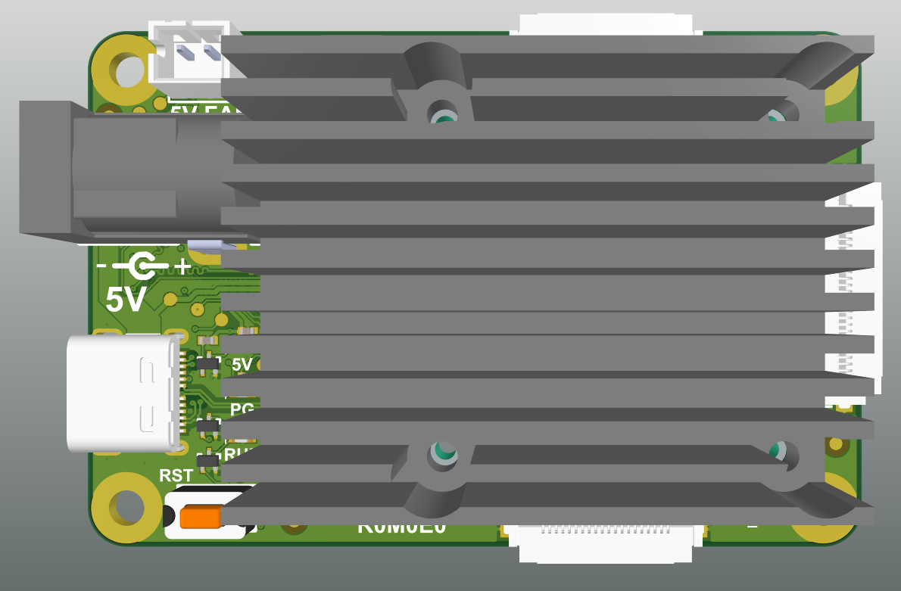
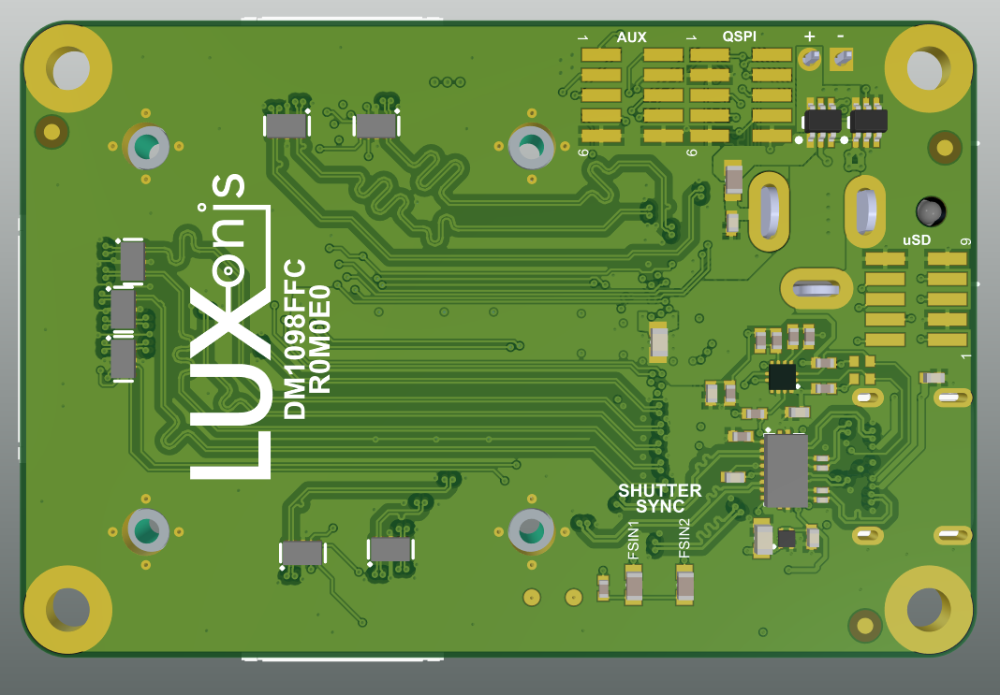

# DM1098FFC DepthAI USB3 Edition (NRND)

DM1098FFC + [DM0250TG](https://github.com/luxonis/depthai-hardware/tree/master/DM0250TG_DepthAI_Mono_Camera) + [DM0249](https://github.com/luxonis/depthai-hardware/tree/master/DM0249_DepthAI_RGB_Camera) are shown together below:

# Project Stage (NRND)

**Caution: This design is now vetted and not meant to be used in a new products or as a reference for new designs, its status is NRND.** 
**This design is more robust update of USB3 FFC (BW1098FFC - status EOL) boards and will be kept in stock as a replacement .**           

**If you don't need a replacement for BW1098FFC which is EOL and you are starting on a new project you should consider buying LUX-F1-BD / DM1090FFC in our online [Luxonis shop](https://shop.luxonis.com/collections/all/products/usb3c-ffc-body) .**   

**FFC reference design DM1090FFC is located [here](https://github.com/luxonis/depthai-hardware/tree/master/DM1090FFC_DepthAI_USB3) .**   

# Overview
This repository contains open hardware designed by Luxonis, and meant to be used as a baseboard for the [Luxonis](https://www.luxonis.com/depthai) OAK-SOM DepthAI SoM. The DM1098FFC baseboard has three FFC interfaces which allow for two [BG0250TG](https://github.com/luxonis/depthai-hardware/tree/master/BG0250TG_DepthAI_Mono_Camera) / [DM0250TG](https://github.com/luxonis/depthai-hardware/tree/master/DM0250TG_DepthAI_Mono_Camera)  camera modules (stereo pair) and one [BG0249](https://github.com/luxonis/depthai-hardware/tree/master/BG0249_DepthAI_RGB_Camera) / [DM0249](https://github.com/luxonis/depthai-hardware/tree/master/DM0249_DepthAI_RGB_Camera) RGB camera module. 

# Repository structure:
* `PCB` contains the packaged Altium project files
* `Docs` contains project output files
* `Images` contains graphics for readme and reference
* `3D Models` contains generated 3D models of the board
# Key features
* 2 BG0250TG/DM0250TG mono camera module interfaces
* 1 BG0249/DM0249 RGB camera module interface
* 5V power input via barrel jack
* USB 3.1 Gen 1 Type-C
* Pads for DepthAI SoM 1.8V SPI
* Pads for DepthAI SoM 3.3V SDIO 
* Pads for DepthAI SoM 1.8V Aux Signals (I2C, UART, GPIO)
* 5V Fan/Aux header
* Pads for DepthAI SoM aux signals
* Design files produced with Altium Designer 20

# Board layout & dimensions

# Getting started  

The DM1098FFC accepts 5V (+/-10%) from a 5.5m x 2.5mm barrel jack, and interfaces to a host via USB 3.1 Gen1 Type-C. With cameras and the DepthAI SoM, total power consumption usually stays below the 900ma specification of USB 3, but Type-C power of 1.5A or greater is recommended. 

Interfacing with the DepthAI SoM is also possible with DM1098FFC connector pads J3, J4, and J5. These pads are designed for the [Amphenol/FCI 20021121-00010T1LF](https://octopart.com/20021121-00010t1lf-amphenol+icc+%2F+fci-93112650?r=sp) or equivalent. Please refer to the schematics for pinout information. 

The reset button resets the Luxonis DepthAI SoM only. 

The 5V LED indicates 5V power is present on the DM1098FFC. The PG LED indicates "power good" from the DepthAI SoM. The "RUN" LED indicates that the DepthAI SoM is not in reset.

# Revision info

These files represent the R1M0E1 revision of this project. Please refer to schematic page, `Project_Information.SchDoc` for full details of revision history.

# Camera Usage

This board is compatible with the [BG0249](https://github.com/luxonis/depthai-hardware/tree/master/BG0249_DepthAI_RGB_Camera) / [DM0249](https://github.com/luxonis/depthai-hardware/tree/master/DM0249_DepthAI_RGB_Camera), connected to the `RGB` FFC port and [BG0250TG](https://github.com/luxonis/depthai-hardware/tree/master/BG0250TG_DepthAI_Mono_Camera) / [DM0250TG](https://github.com/luxonis/depthai-hardware/tree/master/DM0250TG_DepthAI_Mono_Camera), connected to the `CAM_L` and/or `CAM_R` port.

This board can also be used with adapters for the [Raspberry Pi HQ Camera](https://www.raspberrypi.org/products/raspberry-pi-high-quality-camera/), using the [BW0253_R0M0E0 Raspberry Pi HQ Cam Adapter Board](https://github.com/luxonis/depthai-hardware/tree/master/BW0253_R0M0E0_RPIHQ_ADAPTER).

One could trivially change this board design (since it's open source) to allow it to be used with up to 3x [Raspberry Pi HQ Camera](https://www.raspberrypi.org/products/raspberry-pi-high-quality-camera/).  And contact us if this is of interest!  We might just make it.  ;-) 