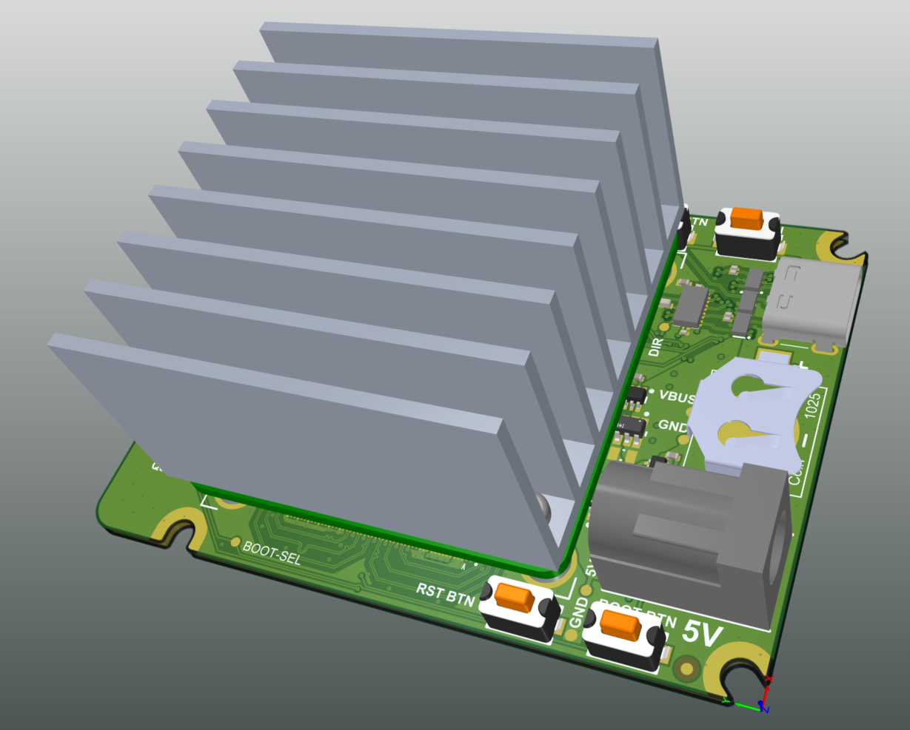
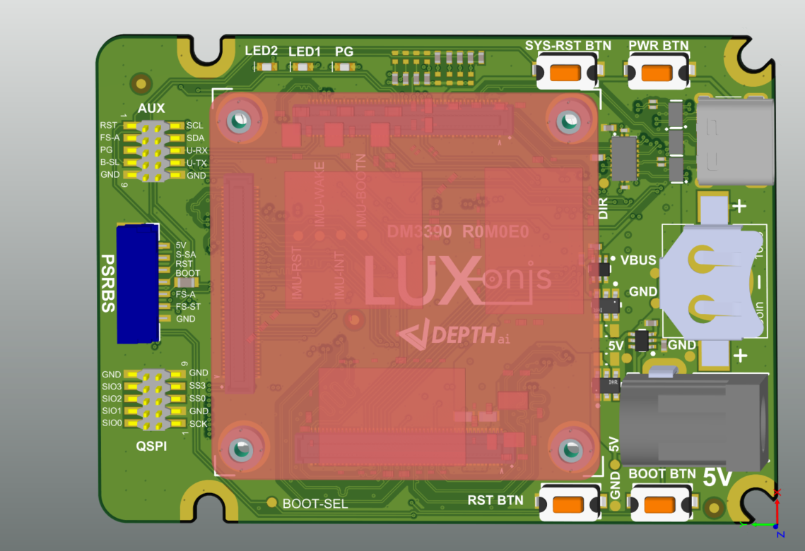
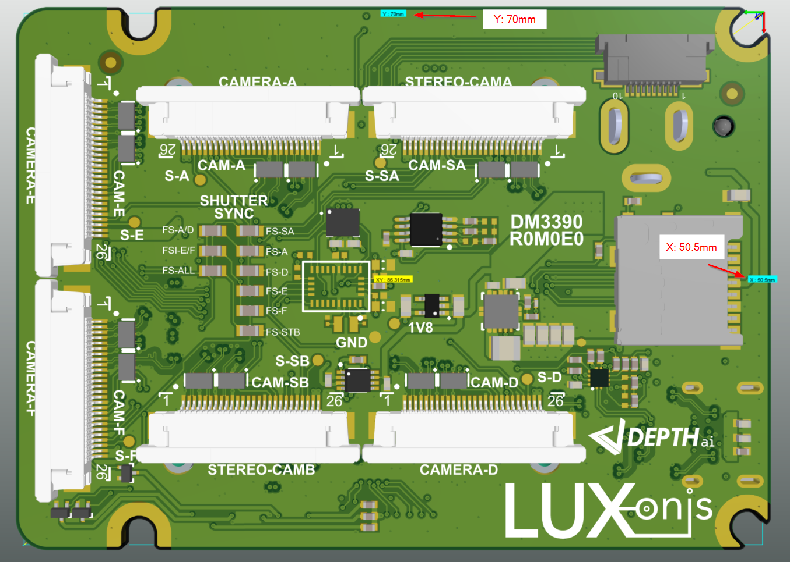

# OAK-FFC-6P

[Documentation here](https://docs.luxonis.com/projects/hardware/en/latest/pages/DM3390.html)

# Project Stage

This repository contains open hardware designed by Luxonis, for a product that is meant to be used as reference design for OAK-SoM-MAX. This is first base board designed for OAK-SoM-MAX and it connects up to 6 cameras.

This comes handy especially when there is a need of multiple cameras that are synced and run together on a single VPU which in this case will be RVP3. To fully support the OAK-SoM-MAX functionality we also added a coin battery (1025) for the RTC and which will not be shipped along with the product. That means you need to get one on your side when this RTC operation is needed also when main power is cut/disrupted.

# Repository structure:
* `PCB` contains the packaged Altium project files
* `Docs` contains project output files
* `Images` contains graphics for readme and reference
* `3D Models` contains generated 3D models of the board
# Key features
* 6x 2-line MIPI camera interfaces (all of the CCMs supported in DepthAI can run on 2-lane MIPI, most of them also in full resolution)
* 5V power input via barrel jack
* USB 3.1 Gen 1 Type-C
* IMU support (BMI270 by default, footprint for BNO086)
* uSD card slot
* Onboard EEPROM
* Pads for DepthAI SoM 1.8V SPI
* Pads for DepthAI SoM 1.8V Aux Signals (I2C, UART, GPIO)
* PSRBS connector (5V, STROBE, RST, BOOT_SEL, FSIN_ALL, FSIN_STEREO)
* 1025 coin battery holder  
* Design files produced with Altium Designer 22

# Board layout & dimensions

OAK-FFC-6P was made with intention that the overall size of the board would be as minimal as possible. 

Dimensions are represented below:

# Getting started  

The DM3390 accepts 5V (+/-10%) from a 5.5m x 2.5mm barrel jack, and interfaces to a host via USB 3.1 Gen1 Type-C. With cameras and the DepthAI SoM, total power consumption usually stays below the 1.5 A specification, Type-C power of 1.5 A or greater is recommended. 

Interfacing with the DepthAI SoM is also possible with DM3390 connector pads QSPI, and AUX. These pads are designed for the [Amphenol/FCI 20021121-00010T1LF](https://octopart.com/20021121-00010t1lf-amphenol+icc+%2F+fci-93112650?r=sp) or equivalent. Please refer to the schematics for pinout information. 

The reset button soft resets the Luxonis DepthAI SoM only, SYS-RST button resets the power system of the DepthAI and PWR button is a GPIO button that can be used to turn off/on the SoM. BOOT button is meant to be used only for recovery purposes changing GPIO boot mode to eMMC recovery when the button is held on system power up. 

The PG LED indicates 5V power is present and all outputs of the DC-DC converters are inside the specified nominal voltages. The LED1 indicates "BOOT" status of the DepthAI SoM. The LED2 is an "CONNECT" status LED which indicates that the DepthAI SoM is connected to the network/device.

# Revision info

These files represent the R0M0E0 revision of this project. Please refer to schematic page, `Project_Information.SchDoc` for full details of revision history.

