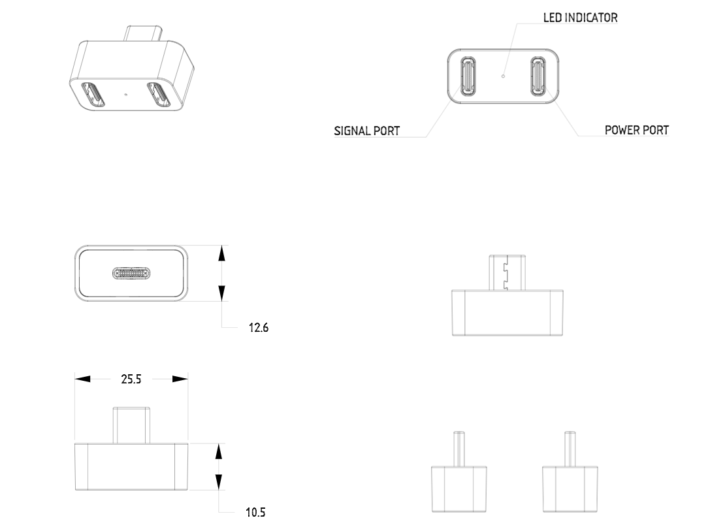
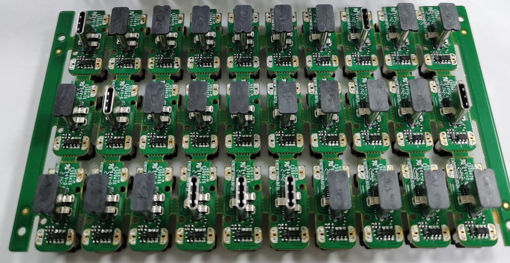
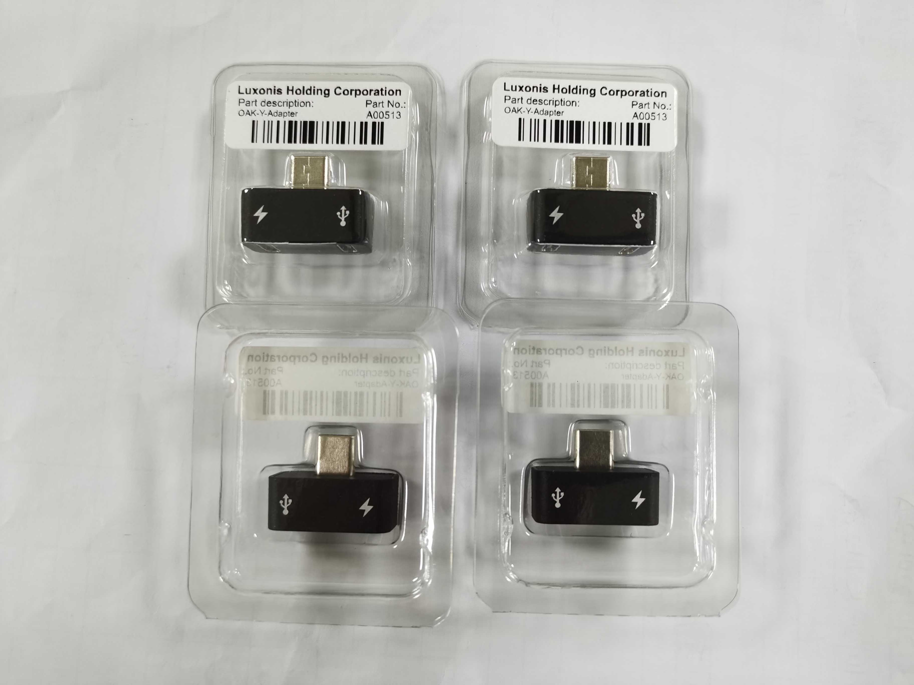

# Y-adapter

# Project Stage

**Product is fully vetted and is series production.**

**It will be soon available on Luxonis web shop, for now it is available only as a Kickstarter add-on, as it was introduced because of OAK-D Lite existence.**        

This repository contains open hardware designed by Luxonis, for a product that is meant to be used as an accessory providing an option to supply the  OAK products with an external USB wall charger. 

This comes handy especially when any of the OAK products which only have a single USB port meant for both the data and power transfer. For some hosts that could be a problem at least with the higher end products which require more power for their operation (such as OAK-D-Pro), but it might be needed even with OAK-D Lite when a host is Raspberry Pi or if more than one OAK-D device is connected to a single host with limited power providing abilities.

# Repository structure:
* `PCB` contains the packaged Altium project files
* `Docs` contains project output files
* `Images` contains graphics for readme and reference
* `3D Models` contains generated 3D models of the board
# Key features
* USB 3.1 Gen 1 Type-C SS data input 
* USB VBUS power input capable of carrying 15W 
* USB 3.1 Gen 1 Type-C output (data + power)
* Design files produced with Altium Designer 22

# Board layout & dimensions

Y-adapter was made with intention that the overall enclosed size would be as minimal as possible. 

Dimensions are represented below:

## Layout OAK-FFC-3P-OG (BW1098FFC/DM1098FFC) vs DM1098EMB:

 

Below is picture of the PCBA so everyone can see what is hidden inside the minimal enclosure. It is nothing special, but the USB-C plug and two USB-C receptacles, which are connected with the data and power path. Power path is controlled with the USB data cable inserted into the related receptacle so the power is delivered to device only when both cables (power and data) are connected.    

For detailed electrical design and mechanical properties please take a look under project folders.

# Getting started  

Usage of the Y-adapter is fairly simple, you just need to connect USB3.0 Type-C data cable to the data input and connect it to host. USB wall charger should be connected with Type-C cable to the power input of the Y-adapter and then you can connect the Y-adapter to OAK USB device which should power up and host should enumerate it as USB3.0 SS device.

The sequence of connecting power/data/Y-adapter can be randomly chosen and does not affect the functionality of the adapter nor the OAK USB device.

# Revision info

These files represent the R2M2E2 revision of this project. Please refer to schematic page, `Project_Information.SchDoc` for full details of revision history.

