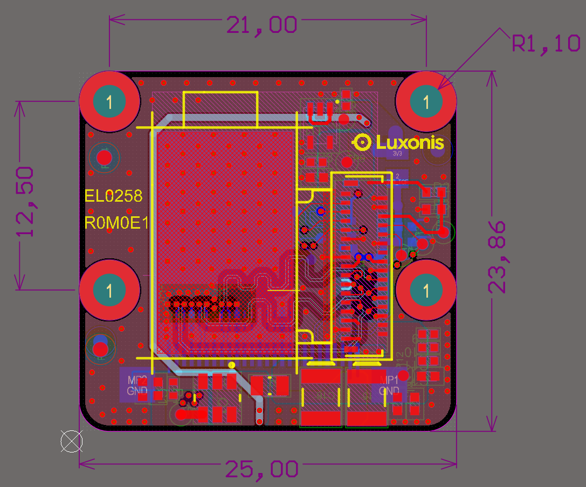
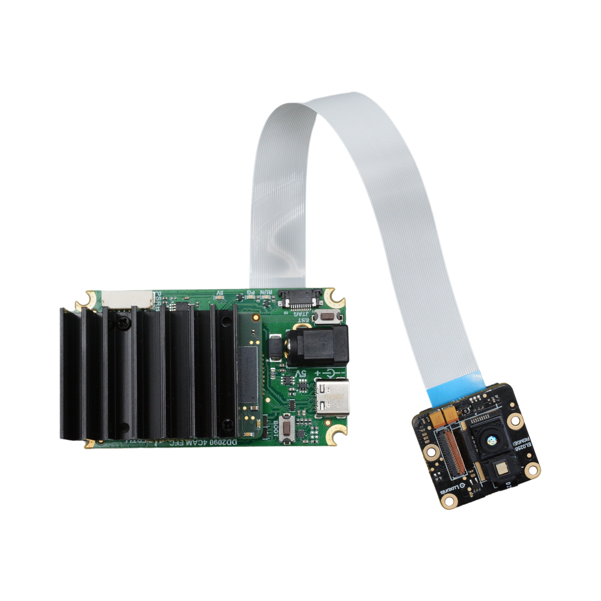

# EL0258 OAK-FFC ToF 33D

[Luxonis store](https://shop.luxonis.com/products/oak-ffc-tof-33d)

# Project Stage

**This project is now tested and prototypes are now vetted.**

# Overview
This repository contains open hardware designed by Luxonis. The EL0258_R0M0E1 is a carrier board for the 33D TOF camera module. A single EL0258 can be used alongside an RGB or Monochrome camera.

# Repository structure:
* `PCB` contains the packaged Altium project files
* `Docs` contains project output files
* `Images` contains graphics for readme and reference
* `3D Models` contains generated mechanical models for the board

# Key features
* 26 pin 0.5mm FFC interconnect to baseboard
* 2-lane MIPI
* Aux/Control signals to camera module
* 3.3V power input via FFC
* On-board power generation for camera module
* Design files produced with Altium Designer 24

# Board layout & dimensions

All dimensions are in millimeters. 

# Getting started
The FFC interface is an 0.5mm pitch, 26-pin, and bottom-contact connector, across which travels the 2-lane MIPI, 3.3V, I2C, camera clock, camera reset, and other optional control lines. 3.3V power is regulated and filtered as appropriate to meet the requirements of the 33D ToF camera module.

# Revision info
These files represent the R0M0E1 revision of this project. Please refer to schematic page, `Project_Information.SchDoc` for full details of revision history.
