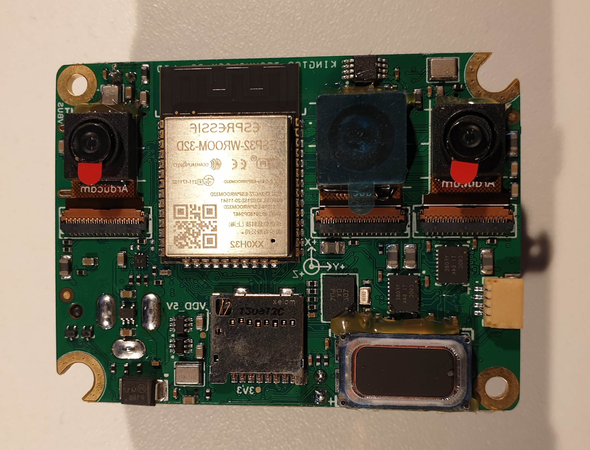
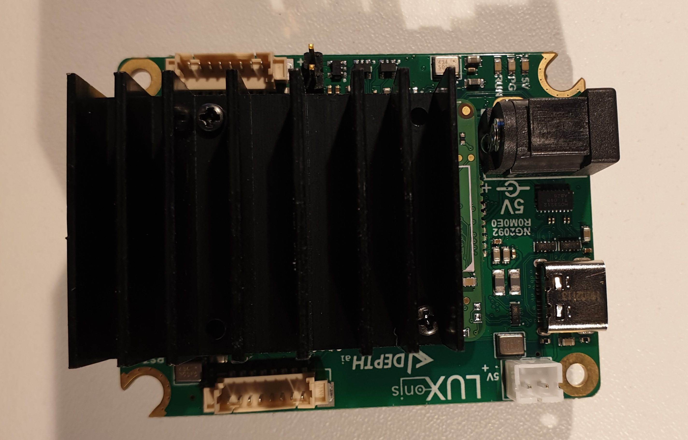
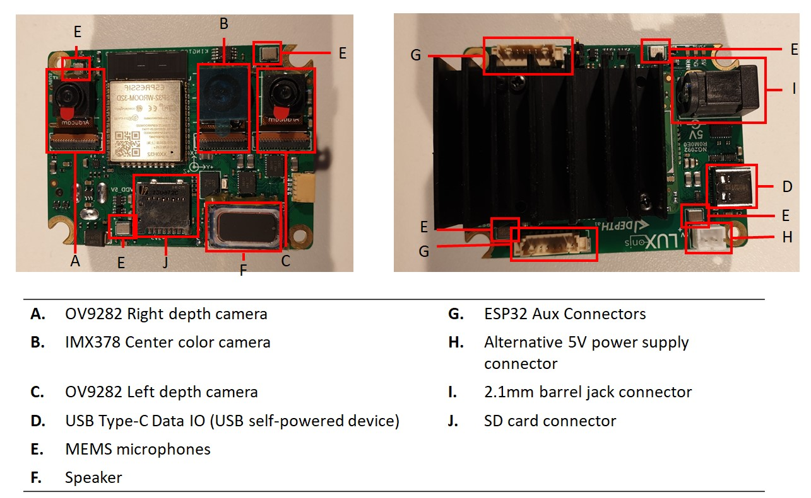
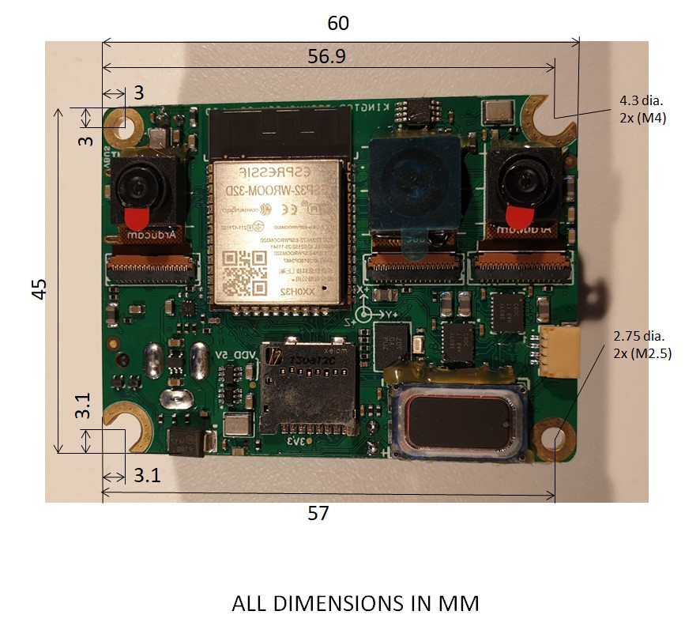

# OAK-D-IoT-40 baseboard (WIP)

# Project Stage

**Caution: This project is still under development. We are currently in process of getting our board prototyped and tested.** 
           **We are proactively making our design available for our uses to plan and provide us with design feedback.** 

This is the first revision and some errors were found in the design:

- Wrong footprint for the 3,3V power supply (TLV62569DBVR)
- Left and right camera MIPI interfaces should be swapped
- Add 1k Pull-down resistors for ESP_GPIO2_D0 and ESP_GPIO12_D2 signals
- Remove ESD diodes D5 and D9 from the design

# Overview

This repository contains open hardware designed by Luxonis, and meant to be used as a baseboard for the [Luxonis](https://docs.luxonis.com/projects/hardware/en/latest/pages/BW2099.html?highlight=som%20pro) BW2099 DepthAI SoM. The OAK-D-IoT-40 baseboard features the following:

- 2x OV9282 depth cameras
- 1x IMX378 color camera
- ESP32 onboard BT and WiFI
- 6x MEMS microphones
- 1x Speaker

More about the "why" are we making this product available and open sourcing you can read in an opened issue [#91.](https://github.com/luxonis/depthai-hardware/issues/91)

## Repository structure:
* `PCB` contains the packaged Altium project files
* `Docs` contains project output files
* `Images` contains graphics for readme and reference
* `3D Models` contains generated 3D models of the board
* `Mechanical` contains models of mounts, enclosures, and other mechanical parts

# Board layout & dimensions

# Getting started

The OAK-D-IoT-40 is powered via USB Type-C connector and requires USB3-capable host, or USB2 host that can provide 2A. Alternatively it can be powered via the 2.1mm barrel jack connector (refer to Annotation image under letter I). USB3 5-Gbps speeds are standard for streaming video or data from the device. With cameras and the DepthAI SoM, total power consumption usually stays below the 900mA specification of USB3. 

# Revision info
These files represent the NG2092_R0M0E0 revision of this project. Please refer to schematic page, `Project_Information.SchDoc` for full details of revision history.
