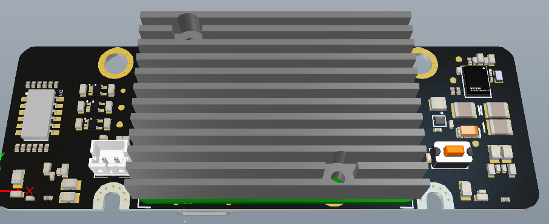
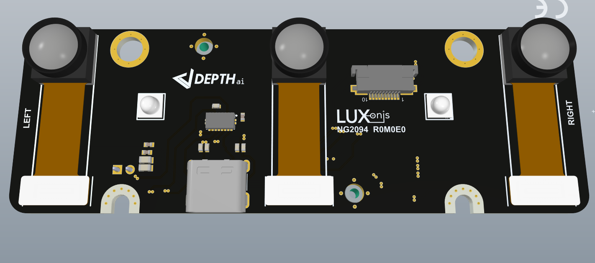
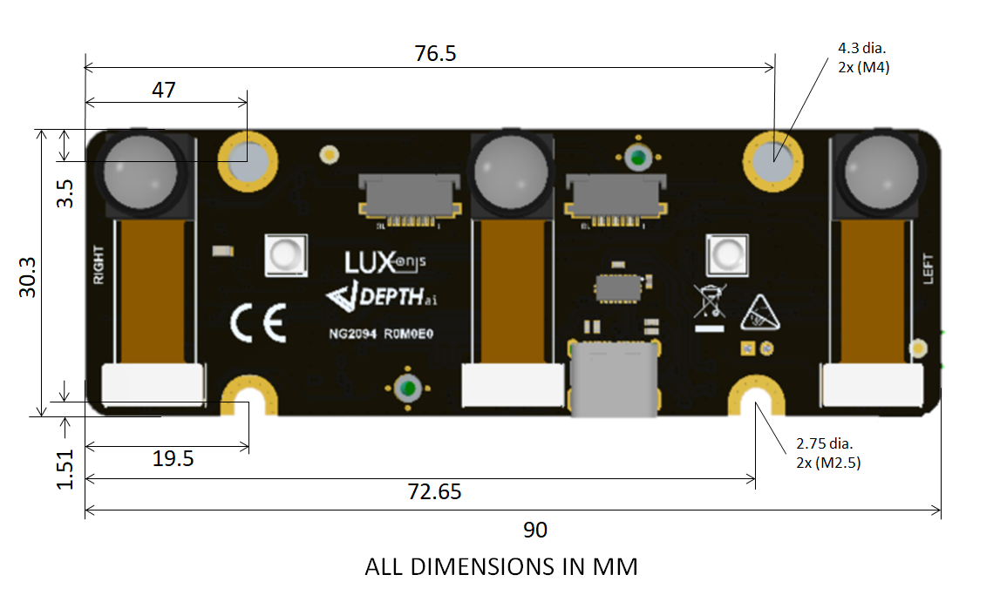

# OAK-D-PRO-W-DEV baseboard (WIP)

# Project Stage

This design is still in the development phase. Some errors might be present in the design or documentation. 

# Overview

This repository contains open hardware designed by Luxonis, and meant to be used as a baseboard for the [Luxonis](https://www.luxonis.com/depthai) BW2099 OAK SoM. The OAK-D-PRO-W-DEV baseboard has three on-board cameras which implement wide angle stereo and RGB vision, piped directly into the OAK SoM for depth and AI processing. The data is then output to a host via USB 3.1 Gen1 (Type-C). Additionally the board implements an IR led for better image capture at night and supports additional two NG6011 boards with dot-projectors. 

More about the "why" are we making this product available and open sourcing you can read in an opened issue [#113.](https://github.com/luxonis/depthai-hardware/issues/113)

## Repository structure:
* `PCB` contains the packaged Altium project files
* `Docs` contains project output files
* `Images` contains graphics for readme and reference
* `3D Models` contains generated 3D models of the board
* `Mechanical` contains models of mounts, enclosures, and other mechanical parts

# Key features
* OV9782 (1280x800) 
* OV9282 (1280x800)
* Support for on-board stereo and RGB camera modules
* Interface for Luxonis BW2099 OAK SoM
* **USB3 Type-C** power only requires USB3-capable host, or USB2 host that can provide 900mA - for example RPi3 and RPi4 
* USB 3.1 Gen1 Type-C
* No enclosure, just the PCBA.
* Design files produced with Altium Designer 21

# Board layout & dimensions

# Getting started

The OAK-D-PRO-W-DEV is powered via USB Type-C connector and requires USB3-capable host, or USB2 host that can provide 2A. Alternatively it can be powered via the 5V JST connector (refer to Annotation image under letter H). USB3 5-Gbps speeds are standard for streaming video or data from the device. With cameras and the OAK SoM, total power consumption usually stays below the 900mA specification of USB3. 

Reset button resets the BW2099 SoM only. Booting can be accomplished from either the USB interface or from the eMMC or NOR flash on the BW2099 SoM, and boot selection is configured with the DIP switch bank  (refer to Annotation image under letter G).   

# Revision info
These files represent the NG2094_R0M0E0 revision of this project. Please refer to schematic page, `Project_Information.SchDoc` for full details of revision history.
