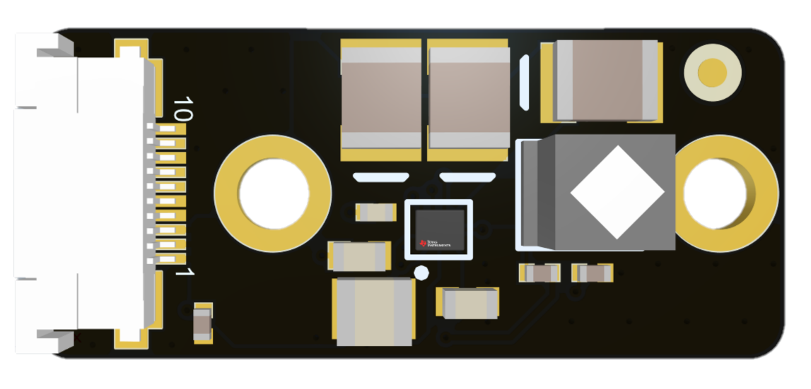
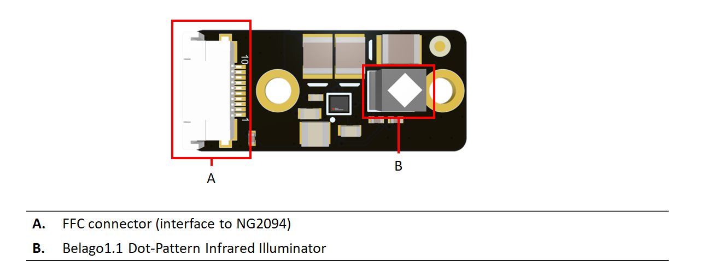
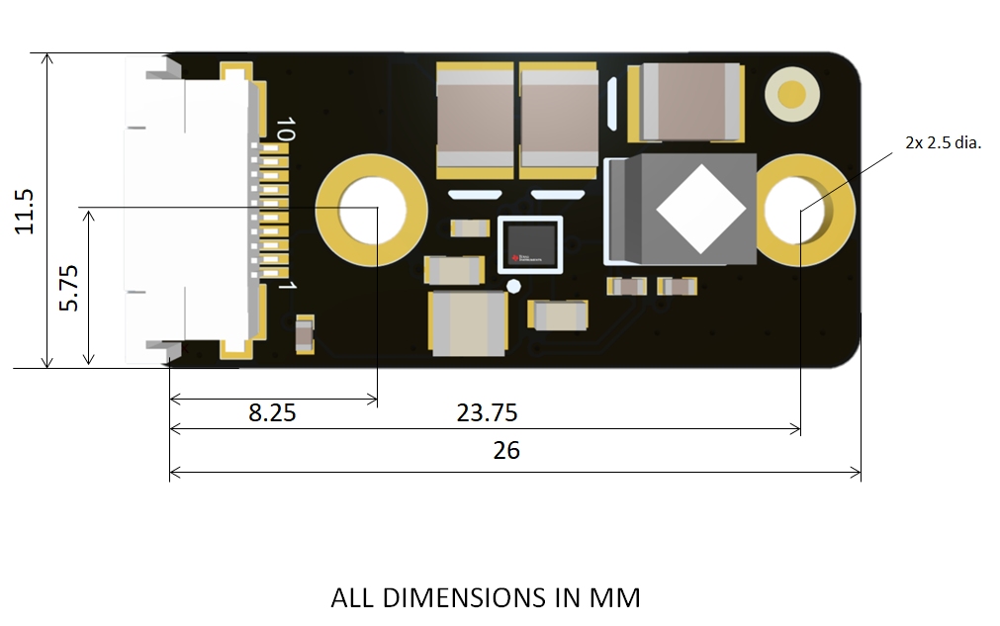

# OAK-D-PRO-W-DEV-DOT accessory board

# Project Stage

This design is still in the development phase. Some errors might be present in the design or documentation. 

# Overview

This repository contains open hardware designed by Luxonis, and meant to be used as an addon for the [Luxonis](https://www.luxonis.com/depthai) NG2094_R0M0E0 board. NG6011 board contains a dot-projector from Belago . All the power requirements and drive signals are provided by the host board (NG2094 OAK-D-PRO-W-DEV). 

## Repository structure:
* `PCB` contains the packaged Altium project files
* `Docs` contains project output files
* `Images` contains graphics for readme and reference
* `3D Models` contains generated 3D models of the board
* `Mechanical` contains models of mounts, enclosures, and other mechanical parts

# Key features
* Belago 1.1 Dot-Patter projector

# Board layout & dimensions

# Getting started

The board interfaces via an FFC cable (Molex: WM11365-ND) to the OAK-D-PRO-W-DEV board.

# Revision info
These files represent the NG6011_R0M0E0 revision of this project. Please refer to schematic page, `Project_Information.SchDoc` for full details of revision history.
