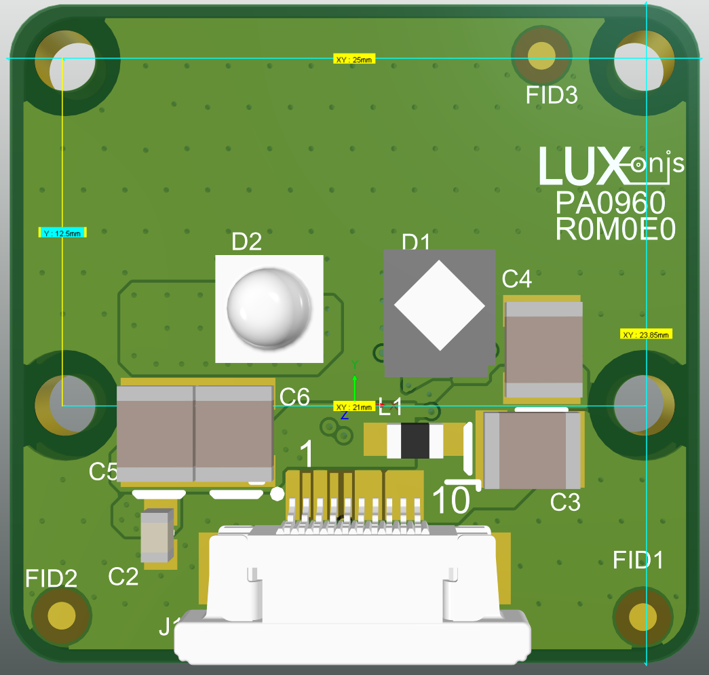
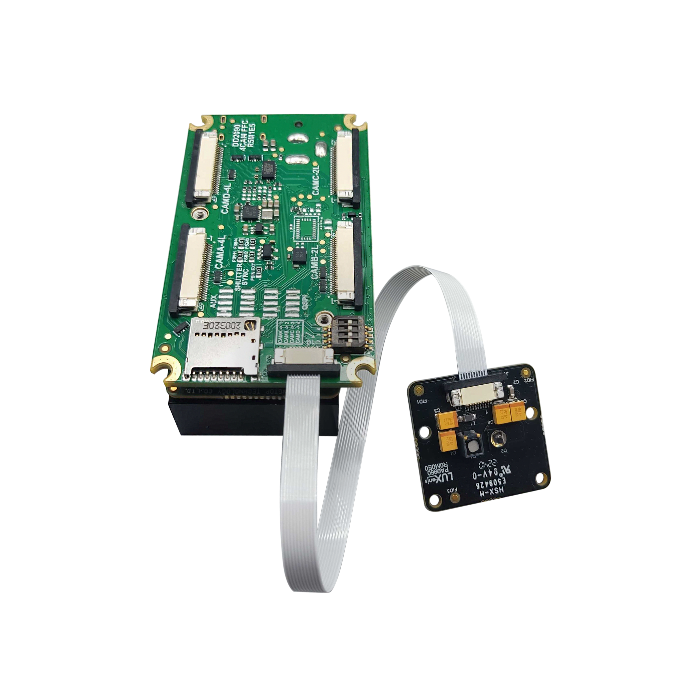

# PA0960_R0M0E0 Camera Board Assembly

# Overview
This repository contains open hardware designed by Luxonis. The PA0960 is an IR dot projector and IR flood light module and is designed to be compatible with [Modular Cameras](https://docs.luxonis.com/projects/hardware/en/latest/#modular-camera-designs) which are, OAK-FFC-4P, and OAK-FFC-6P (more to come). 

The advantage of this new OAK-FFC-IR design is that the IR dot projector and flood light performance can be determined with other OAK-DDC-CBA modules.  

# Repository structure:
* `PCB` contains the packaged Altium project files
* `Docs` contain project output files
* `Images` contain graphics for readme and reference
* `3D Models` contain generated mechanical models for the board 

# Key features
* 10-pin 0.5mm FFC interconnect to baseboard
* 5V power input via FFC
* IR LED and IR dot projector that are used on all of our **Pro** devices
* Design files produced with Altium Designer 23 

# Board layout & dimensions

Board outline is the same as for other versions of FFC **C**amera **B**oard **A**ssemblies so the dimensions are consequentially the same as well. 

Board layout designed in Altium designer can be found in the PCB subfolder.  

# Getting started  
The 0.5mm pitch, 10-pin 15cm long FFC is included with each camera that is sold by Luxonis or any of its legal distributors. We are using a bottom-contact connector on all our Modular camera boards. The correct connection can be seen on below photos, please note the blue section on the FPC for correct orientation: 

 

# Revision info
These files represent the R0M0E0 revision of this project. Please refer to schematic page, `Project_Information.SchDoc` for full details of revision history.
