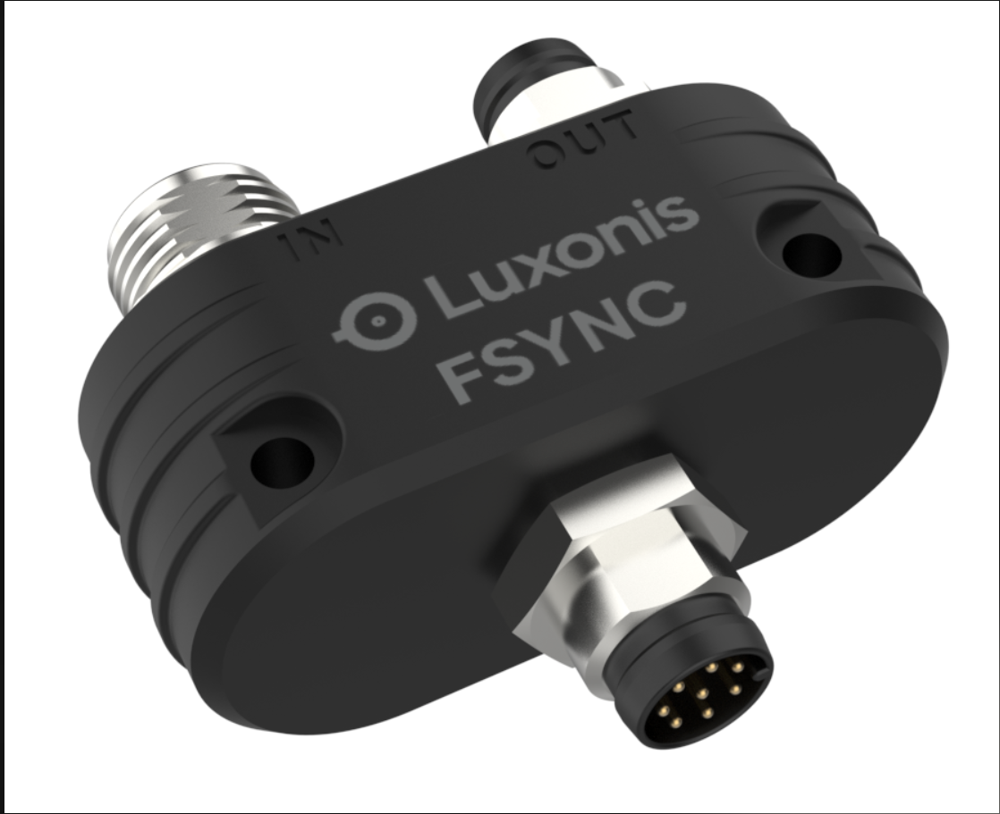
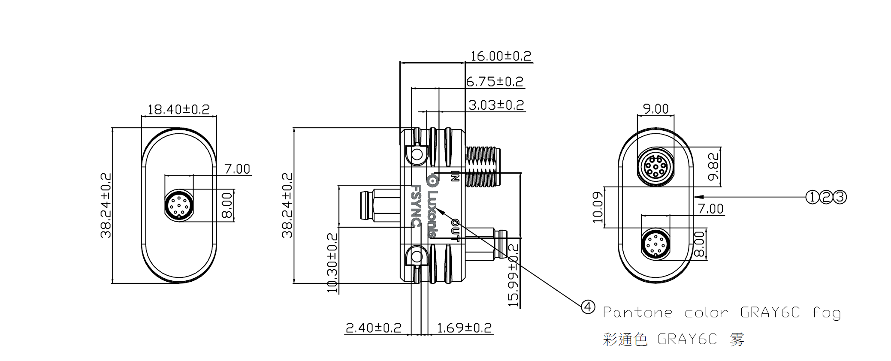
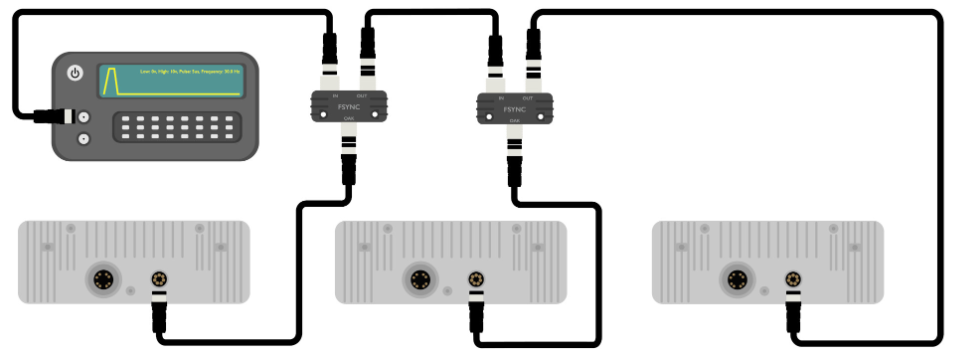

# Y-FSync adapter

[Documentation here](https://docs.luxonis.com/projects/hardware/en/latest/pages/FSYNC_Yadapter/)

# Project Stage

**Product is fully vetted and is series production.**

**Product is available on Luxonis web shop, under the Early Access section ([Link](https://shop.luxonis.com/collections/early-access))**

This repository contains open hardware designed by Luxonis, for a product that is meant to be used as an accessory providing an option to FrameSync multiple devices daisy chaining them into a single cluster. 

Repository structure:

* `PCB` contains the packaged Altium project files
* `Docs` contains project output files
* `Images` contains graphics for readme and reference
* `3D Models` contains generated 3D models of the board
# Key features
* M8 male device side output ((Power + FSync + GPIOs + USB) passthrough)
* M8 female daisy-chain input ((Power + FSync + GPIOs + USB) passthrough)
* M8 male daisy-chain output (FSync passthrough)

# Board layout & dimensions

Y-FSync adapter was made with intention that the overall enclosed size would be as minimal as possible. 

Dimensions are represented below:

# Getting started

Usage of the Y-adapter is fairly simple, you just need to connect M8 cables and setup daisy-chain configuration. Hardware frame syncing is achieved passing through the FSync signal from one to another camera. Master can either be the first device in the chain or it can be the external generator connected to the first INput of the adapters in the chain.

Basic wiring is showcased on the below diagram:

# Revision info

These files represent the R1M0E1 revision of this project. Please refer to schematic page, `Project_Information.SchDoc` for full details of revision history.

