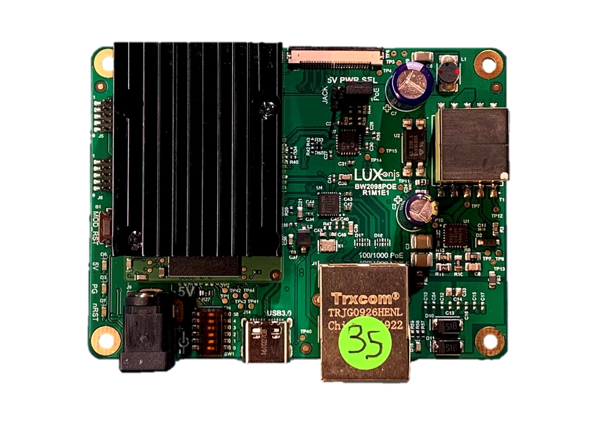
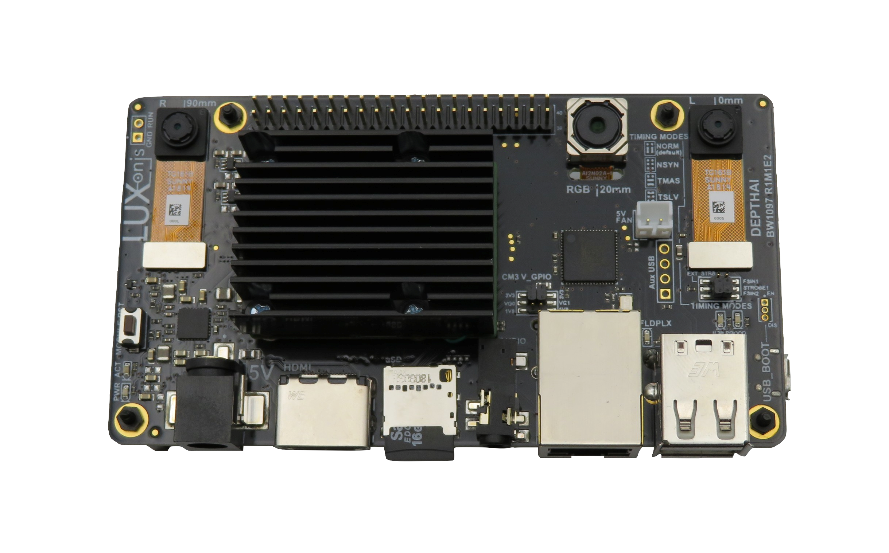
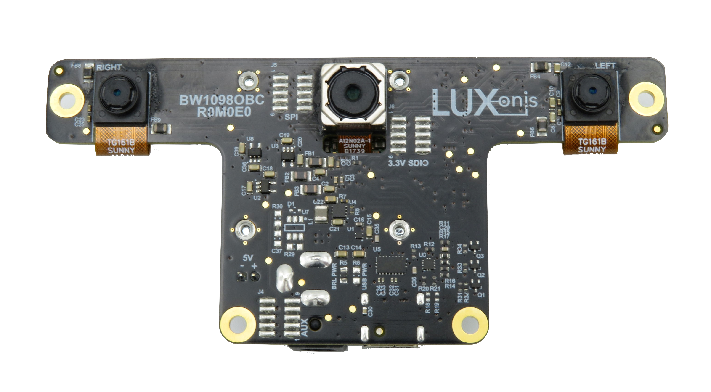
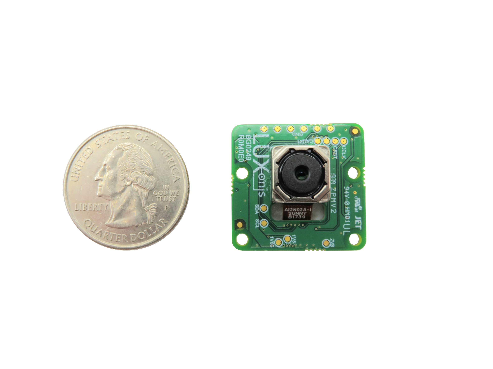
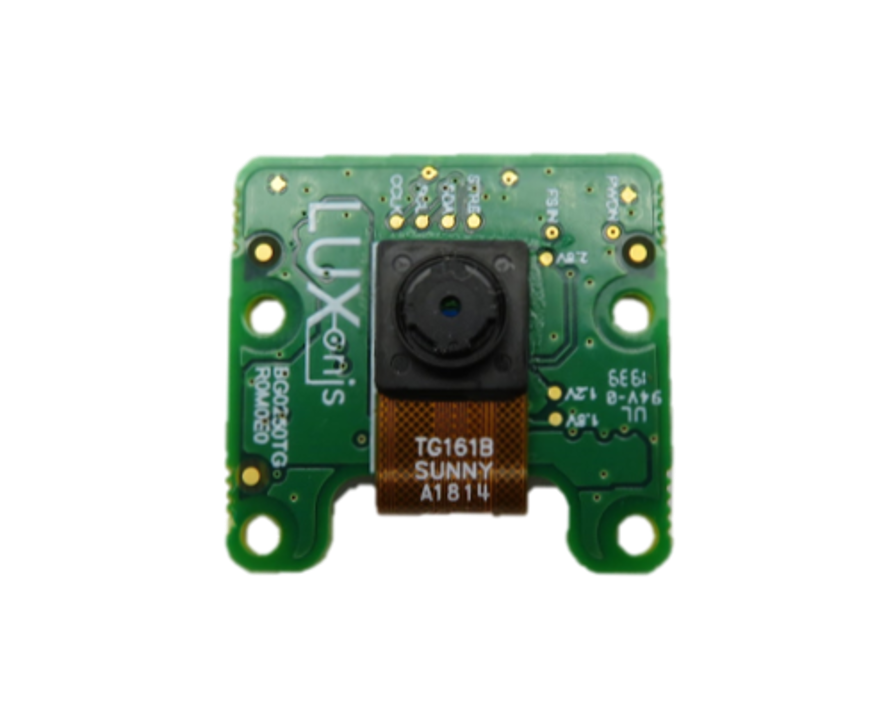
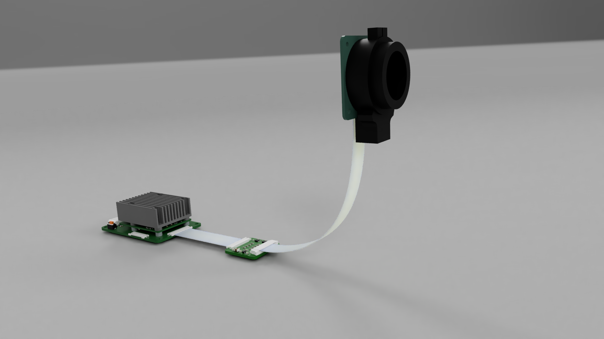

# DepthAI Open Source Hardware
This repository contains Luxonis open sourced baseboards, and contains Altium design files, documentation, and pictures. This repository is for anyone interested in developing with the DepthAI SoM or anyone interested in understaning more about the embedded hardware that powers DepthAI. An open source, community KiCad folder is also available for sharing KiCad based designs and components. 

# POE Designs

## [BW2098POE](https://github.com/luxonis/depthai-hardware/tree/master/BW2098POE_PoE_Board)
The [BW2098POE repository](https://github.com/luxonis/depthai-hardware/tree/master/BW2098POE_PoE_Board) contains open hardware designed by Luxonis, and meant to be used as a baseboard for the [Luxonis](https://www.luxonis.com/depthai) BW2099 DepthAI SoM. The BW2098POE baseboard offers full 802.3af, Class 3 PoE compliance with 1000BASE-T speeds, along with user-selectable external power from a 5V barrel jack. The Luxonis BW0249 12MP RGB camera module can be connected via the 26-pin FFC interface, which exposes a 4-lane MIPI CSI-2 channel directly into the Myriad X on the BW2099 module for processing. Data can also be streamed to a host via USB 3.1 Gen1 (Type-C). Finally, the BW2098POE board exposes boot selection switches, allowing the end user to boot the BW2099 module from USB or the on-board eMMC or NOR flash.

## [SJ2088POE](https://github.com/luxonis/depthai-hardware/tree/master/SJ2088POE_PoE_Board)

This board is the basis for the OAK-D-POE.  And it is the equivalent of the BW1098OBC/BW1098OAK, but with POE instead of USB.  So 3 onboard cameras (1x onboard IMX378 12MP autofocus color camera, 2x global shutter grayscale for stereo depth), with the stereo baseline being 7.5cm (just like BW1098OBC/BW1098OAK/OAK-D).  

This design is in progress.  When complete it will support the DepthAI API over Ethernet, and some additional features like direct RTSP streaming.

## [SJ2096POE](https://github.com/luxonis/depthai-hardware/tree/master/SJ2096POE_R0M0E0)

This is the basis for OAK-1-POE.  It is the equivalent of the BK1096_OAK, with with POE instead of USB.  So 1x onboard IMX378 12MP autofocus color camera.

This design is in progress.  When complete it will support the DepthAI API over Ethernet, and some additional features like direct RTSP streaming.

# Integrated Raspberry Pi Design

## [BW1097](BW1097_DepthAI_Compute_Module)
The [BW1097 repository](/BW1097_DepthAI_Compute_Module) contains open hardware designed by Luxonis, and meant to be used as a baseboard for the [Luxonis](https://www.luxonis.com/depthai) BW1099 DepthAI SoM and the [Raspberry Pi Compute Module 3+](https://www.raspberrypi.org/products/compute-module-3-plus/). Based on the Raspberry PI CMIO board, the BW1097 combines a host and the Luxonis DepthAI SoM to allow for fully integrated solution for real-time spatial AI. 

# Pure Embedded Design

## [BW1092](https://github.com/luxonis/depthai-hardware/tree/master/BW1092_ESP32_Embedded_WIFI_BT)

This design showcases WiFi+BT interface and a pure-embedded usecase of DepthAI, with communication over SPI from depthai BW1099EMB to the onboard ESP32.  This device can be programmed and run completely standalone with no host processor (i.e. no Linux, macOS, Windows, or RPi required).

It also acts as a convenient way to do AIoT - that is, using onboard AI to compress data to information to then insight.  An example in a (remote) construction environment is returning a single byte from the device every couple seconds, with each bit representing if anything unsafe is happening, if there is a fire, if there is a hard-hat violation, a leak, etc.

Or conversely, driving a transducer to communicate the number of fish observed, their size, and species 1km through water, through the water as radio waves back to a fishing vessel.

# USB Designs

## [BW1098OBC](BW1098OBC_DepthAI_USB3C)
The [BW1098OBC repository](BW1098OBC_DepthAI_USB3C) contains open hardware designed by Luxonis, and meant to be used as a baseboard for the [Luxonis](https://www.luxonis.com/depthai) BW1099 DepthAI SoM. The BW1098OBC baseboard has three on-board cameras which implement stereo and RGB vision, piped directly into the DepthAI SoM for depth and AI processing. The data is then output to a host via USB 3.1 Gen1 (Type-C). 

## [BW1098FFC](BW1098FFC_DepthAI_USB3)
The [BW1098FFC repository](BW1098FFC_DepthAI_USB3) contains open hardware designed by Luxonis, and meant to be used as a baseboard for the [Luxonis](https://www.luxonis.com/depthai) BW1099 DepthAI SoM. The BW1098FFC baseboard has three FFC interfaces which allow for two [BG0250TG](BG0250TG_DepthAI_Mono_Camera) camera modules (stereo pair) and one [BG0249](BG0249_DepthAI_RGB_Camera) RGB camera module. 

## [BW1094](BW1094_DepthAI_HAT)
The [BW1094 repository](BW1094_DepthAI_HAT) contains open hardware designed by Luxonis, and meant to be used as a baseboard for the [Luxonis](https://www.luxonis.com/depthai) BW1099 DepthAI SoM and as a HAT for the [RPi "B" models](https://www.raspberrypi.org/products/). The BW1094 baseboard has three FFC interfaces which allow for two [BG0250TG](BG0250TG_DepthAI_Mono_Camera) camera modules (stereo pair) and one [BG0249](BG0249_DepthAI_RGB_Camera) RGB camera module. The GPIO interface from the Raspberry Pi Model B variants is passed through the BW1094 with the exception of the 5V pins, GND pins, and [BCM GPIO26 (pin 37)](https://www.raspberrypi.org/documentation/usage/gpio/), which is used as a way for the Raspberry Pi to reset the DepthAI SoM, parallel to the RST button.  

## [BK1096](BK1096_OAK-1_Modular)
The [BK1096 repository](/BK1096_OAK-1_Modular) contains open hardware designed by Luxonis, and meant to be used as a baseboard for the [Luxonis](https://www.luxonis.com/depthai) BW1099 DepthAI SoM. The BK1096 baseboard offers a quick and simple way to add USB3 Type-C device power and connectivity, and a single 12MP RGB camera module to the DepthAI SoM. 

# Cameras and Camera Adapter Boards

## [BG0249](BG0249_DepthAI_RGB_Camera)
The [BG0249 repository](BG0249_DepthAI_RGB_Camera) contains open hardware designed by Luxonis. The BW0249 is a carrier board for the Sunny A12N02A IMX378 camera module, and is designed to be compatible with the [BW1094](BW1094_DepthAI_HAT) and [BW1098FFC](BW1098FFC_DepthAI_USB3) baseboards. A 26-pin FFC is used to carry 5V power, 4-lane MIPI, I2C, and other control signals between the BW0249 and the controller baseboards. 

## [BG0250TG](BG0250TG_DepthAI_Mono_Camera)
The [BG0250TG repository](BG0250TG_DepthAI_Mono_Camera) contains open hardware designed by Luxonis. The BW0250TG is a carrier board for the Sunny TG161B or AN01V32 OV9282 camera module, and is designed to be compatible with the [BW1094](BW1094_DepthAI_HAT) and [BW1098FFC](BW1098FFC_DepthAI_USB3) baseboards. A 20-pin FFC is used to carry 5V power, 2-lane MIPI, I2C, and other control signals between the BW0250TG and the controller baseboards. A single BG0250TG is typically paired with another to create a stereo camera pair.

## [BW0253_R0M0E0 Raspberry Pi HQ Cam Adapter Board](/BW0253_R0M0E0_RPIHQ_ADAPTER)

The [BW0253_R0M0E0](/BW0253_R0M0E0_RPIHQ_ADAPTER) is an adapter board to allow the [Raspberry Pi HQ camera](https://www.raspberrypi.org/products/raspberry-pi-high-quality-camera/) to physically interface to the DepthAI RGB camera port on the [BW1098FFC](https://github.com/luxonis/depthai-hardware/tree/master/BW1098FFC_DepthAI_USB3). 

This allows using DepthAI with all sorts of lens combinations, including variable zoom, variable focus, and even [with a telescope](https://www.tomshardware.com/news/raspberry-pi-high-quality-camera-used-for-out-of-this-world-astrophotography).

