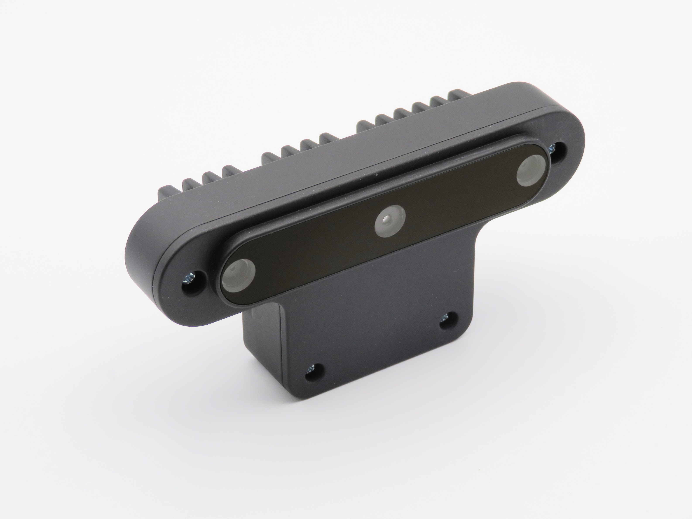
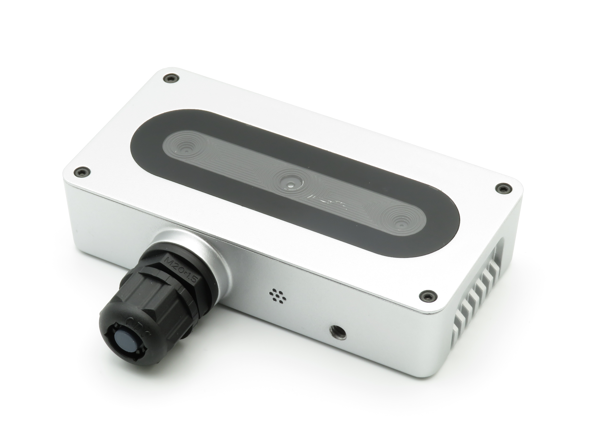

# DepthAI Open Source Hardware
This repository contains Luxonis open sourced baseboards, Altium design files, documentation, and pictures. This repository is for anyone interested in developing with the OAK SoM or anyone interested in understaning more about the embedded hardware that powers DepthAI. An open source, community KiCad folder is also available for sharing KiCad based designs and components. 

# USB Designs

## [OAK-D | BW1098OAK](BW1098OAK_USB3C)

[Github repository:](BW1098OAK_USB3C)
[Documentation:](https://docs.luxonis.com/projects/hardware/en/latest/pages/BW1098OAK.html) 

## [OAK-D-PCBA | BW1098OBC](BW1098OBC_DepthAI_USB3C)

[Github repository:](BW1098OBC_DepthAI_USB3C)
[Documentation:](https://docs.luxonis.com/projects/hardware/en/latest/pages/BW1098OBC.html) 

## [OAK-1-PCBA | BK1096](BK1096_OAK-1_Modular)

[Github repository:](BK1096_OAK-1_Modular)

# POE Designs

## [OAK-D-PoE | SJ2088POE](SJ2088POE_PoE_Board)

[Github repository:](SJ2088POE_PoE_Board)
[Documentation:](https://docs.luxonis.com/projects/hardware/en/latest/pages/SJ2088POE.html) 

## [OAK-1-PoE | SJ2096POE](SJ2096POE_R0M0E0)

[Github repository:](SJ2096POE_R0M0E0)
[Documentation:](https://docs.luxonis.com/projects/hardware/en/latest/pages/SJ2096POE.html) 

## [PoE Board | BW2098POE](BW2098POE_PoE_Board)

[Github repository:](BW2098POE_PoE_Board)
[Documentation:](https://docs.luxonis.com/projects/hardware/en/latest/pages/BW2098POE.html) 

# IoT Designs

## [OAK-D-IoT-40](DM1092_ESP32_Embedded_WIFI_BT_IMU)

[Github repository:](DM1092_ESP32_Embedded_WIFI_BT_IMU)
[Documentation:](https://docs.luxonis.com/projects/hardware/en/latest/pages/DM1092.html) 

## [OAK-D-IoT-75](DM1098OBC_DepthAI_USB3C_WIFI)

[Github repository](DM1098OBC_DepthAI_USB3C_WIFI)
[Documentation:](https://docs.luxonis.com/projects/hardware/en/latest/pages/DM1098OBC.html)

## [BW1092](BW1092_ESP32_Embedded_WIFI_BT)

[Github repository:](BBW1092_ESP32_Embedded_WIFI_BT)

# Modular Cameras Designs

## [OAK-FFC-3P| DM1090FFC](DM1090FFC_DepthAI_USB3)

[Github repository:](DM1090FFC_DepthAI_USB3)
[Documentation:](https://docs.luxonis.com/projects/hardware/en/latest/pages/DM1090.html) 

## [OAK-FFC-3P-OG | BW1098FFC](BW1098FFC_DepthAI_USB3)

[Github repository:](BW1098FFC_DepthAI_USB3)
[Documentation:](https://docs.luxonis.com/projects/hardware/en/latest/pages/BW1098FFC.html) 

## [OAK-FFC-IMX378 | BG0249](BG0249_DepthAI_RGB_Camera)

[Github repository:](BG0249_DepthAI_RGB_Camera)
[Documentation:](https://docs.luxonis.com/projects/hardware/en/latest/pages/BG0249.html) 

## [OAK-FFC-OV9282 | BG0250TG](BG0250TG_DepthAI_Mono_Camera)

[Github repository:](BG0250TG_DepthAI_Mono_Camera)
[Documentation:](https://docs.luxonis.com/projects/hardware/en/latest/pages/BG0250TG.html) 

# All In One Dev. Kits

## [OAK-D-CM4 | DM1097](DM1097_DepthAI_Compute_Module_4)

[Github repository:](DM1097_DepthAI_Compute_Module_4)
[Documentation:](https://docs.luxonis.com/projects/hardware/en/latest/pages/DM1097.html) 

## [OAK-D-CM3 | BW1097](BW1097_DepthAI_Compute_Module)

[Github repository:](DM1097_DepthAI_Compute_Module_4)
[Documentation:](https://docs.luxonis.com/projects/hardware/en/latest/pages/BW1097.html) 

# System on Module

## [OAK-SoM](SoMs/OAK-SOM)

[Github repository:](SoMs/OAK-SOM)
[Documentation:](https://docs.luxonis.com/projects/hardware/en/latest/pages/BW1099.html) 

## [OAK-SoM-Pro](SoMs/OAK-SOM-PRO)

[Github repository:](SoMs/OAK-SOM-PRO)
[Documentation:](https://docs.luxonis.com/projects/hardware/en/latest/pages/BW2099.html) 

## [OAK-SoM-Pro](SoMs/OAK-SOM-IoT)

[Github repository:](SoMs/OAK-SOM-IoT)

# Miscellaneous Designs

## [DepthAI RPi HAT Baseboard | BW1094](BW1094_DepthAI_HAT)

[Github repository:](BW1094_DepthAI_HAT)
[Documentation:](https://docs.luxonis.com/projects/hardware/en/latest/pages/BW1094.html) 

## [Raspberry Pi Adapter Camera | BW0253](BW0253_R0M0E0_RPIHQ_ADAPTER)

[Github repository:](BW0253_R0M0E0_RPIHQ_ADAPTER)
[Documentation:](https://docs.luxonis.com/projects/hardware/en/latest/pages/BW0253.html) 

