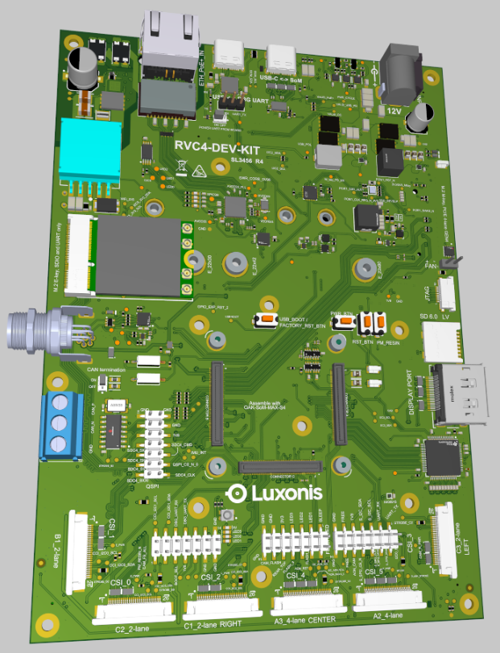
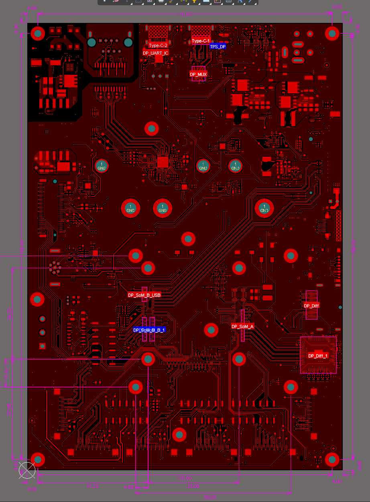

# OAK4-DEVKIT

# Project Stage

This repository contains open hardware designed by Luxonis, for a product that is meant to be used as reference design for OAK4 SoM. This is first base board designed for OAK4 SoM and it connects up to 5 cameras at once.

This comes handy especially when there is a need of multiple cameras that are synced and run together on a single platform which in this case will be RVC4. 

# Repository structure:
* `Docs` contains quick start guide, OAK4 SoM pinout and a spec sheet
* `Images` Images of the board
* `Mechanical ` contains 3D model and 2D DXF file for the board
* `Source Files` contains the packaged Altium project files and a PDF schematic
# Key features
* POE+ (802.3at) power input via RJ45
* 12V power input via barrel jack
* USB 3.1 Gen 1 Type-C (Supports USB PD)
* 2x 4-lane and 4x 2-lane MIPI camera interfaces (5 cameras supported simultaneously)
* Light meter and pressure sensor

* 2230 / 2242 / 2280 E-key connector (SDIO/UART only)

- 2242 / 2280 M-key NVME connector
- CAN connector
- uSD card slot
- M8 connector (FSYNC, GPIO, USB)
- PSRBS connector (5V, STROBE, RST, BOOT_SEL, FSIN_ALL, FSIN_STEREO)
- GPIO headers
- USB Type-C connector for debug port
- Onboard EEPROM
- 2.5Gbit ethernet via RJ45 connector
- 4x onboard Microphones
- 6DOF IMU and Magnetometer

# Board layout & dimensions

# Getting started  

Please refer to the /Docs/Getting started with OAK4-DEV-KIT.pdf document for detailed bring-up guide.

# Revision info

These files represent the R4D1V0 revision of this project. Please refer to schematic page, `Project_Information.SchDoc` for full details of revision history.

