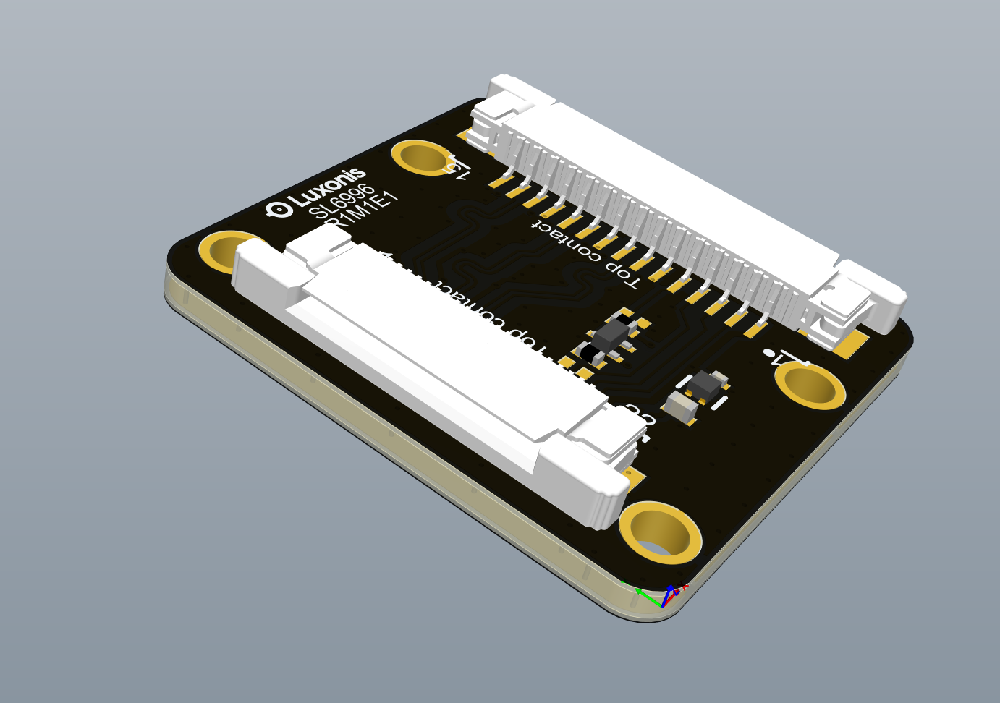
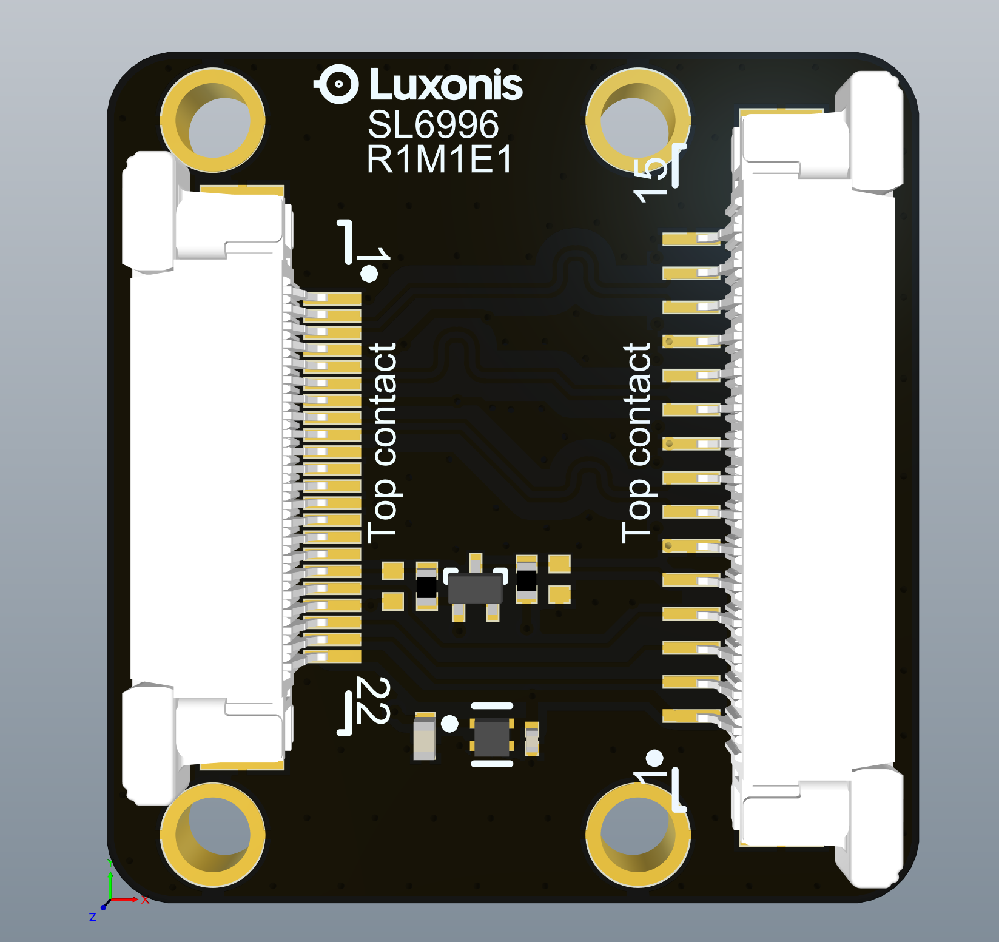
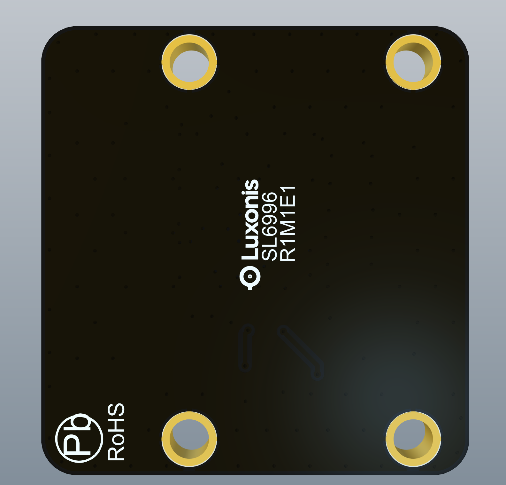
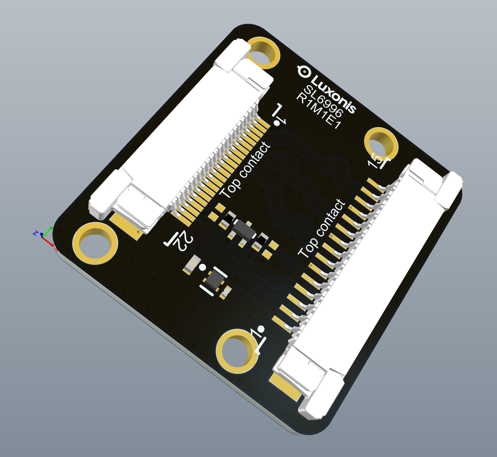

# OAK-FFC to RPi 15-pin FFC adapter

# Project Stage

The design was fully vetted and can be used as reference. 

# Overview

This repository contains open hardware designed by Luxonis. Adapter board is meant to be used with the OAK-FFC-*P baseboards (OAK-FFC-4P, OAK-FFC-4P-PoE, OAK-FFC-3P, ...). Connecting any 15-pin RPi cameras to OAK-FFC baseboards is now possible using this adapter. 

## Repository structure:
* `PCB` contains the packaged Altium project files
* `Docs` contains project output files
* `Images` contains graphics for readme and reference
* `3D Models` contains generated 3D models of the board
* `Mechanical` contains models of mounts, enclosures, and other mechanical parts

# Key features
* Adapter for 15-pin RPi camera pinout

# Board layout & dimensions

# Getting started

RPi cameras with 15-pin FFC connector can be connected with adapter including 15-pin FFC and with use of 26 --> 22pin adapter cable that is already part of the OAK-FFC-**P package. 

# Revision info
These files represent the SL6996_R1M1E1 revision of this project. Please refer to schematic page, `Project_Information.SchDoc` for full details of revision history.
