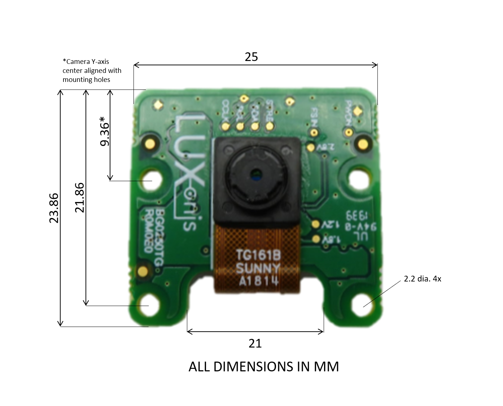
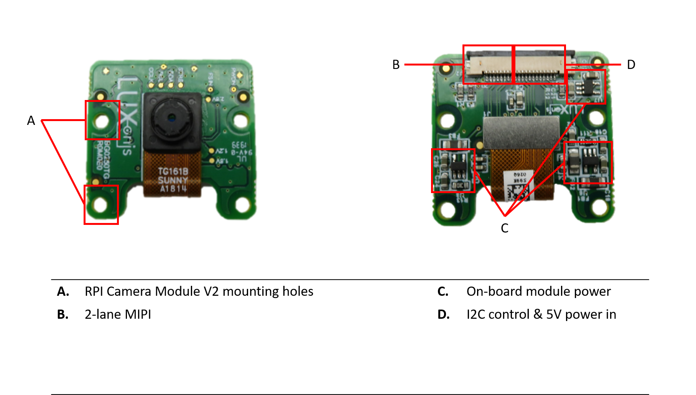

.. _bg0250tg:

Mono Camera Module (BG0250TG_R0M0E0)
====================================

.. image:: ../../../BG0250TG_DepthAI_Mono_Camera/Images/BG0250TG_R0M0E0_front.png

Overview
********

The BW0250TG is a carrier board for the Sunny TG161B or AN01V32 OV9282 camera module, and is designed to be compatible with the :ref:`BW1094 <bw1094>` and 
:ref:`BW1098FFC <bw1098ffc>` baseboards. A 20-pin FFC is used to carry 5V power, 2-lane MIPI, I2C, and other control signals between the BW0250TG and the 
controller baseboards. A single BG0250TG is typically paired with another to create a stereo camera pair.

Key features
************

* 20 pin 0.5mm FFC interconnect to baseboard
* 24 pin interface to OV9282 camera module
* 2-lane MIPI
* Aux/Control signals to camera module
* 5V power input via FFC
* On-board power generation for camera module
* Design files produced with Altium Designer 20

Board layout & dimensions
*************************

Alium project files
*******************

See files `here <https://github.com/luxonis/depthai-hardware/tree/master/BG0250TG_DepthAI_Mono_Camera/PCB>`__

Project output files
********************

* `Assembly Drawing <https://github.com/luxonis/depthai-hardware/blob/master/BG0250TG_DepthAI_Mono_Camera/Docs/Assembly%20Drawing%20PDF/Production.PDF>`__
* `Assembly Outputs <https://github.com/luxonis/depthai-hardware/tree/master/BG0250TG_DepthAI_Mono_Camera/Docs/Assembly%20Outputs>`__
* `Fabrication Drawing <https://github.com/luxonis/depthai-hardware/blob/master/BG0250TG_DepthAI_Mono_Camera/Docs/Fabrication%20Drawing%20PDF/Production.PDF>`__
* `Fabrication Outputs <https://github.com/luxonis/depthai-hardware/tree/master/BG0250TG_DepthAI_Mono_Camera/Docs/Fabrication%20Outputs>`__
* `Schematic <https://github.com/luxonis/depthai-hardware/blob/master/BG0250TG_DepthAI_Mono_Camera/Docs/Schematic%20PDF/Production.PDF>`__

3D Models
*********

Download `here <https://github.com/luxonis/depthai-hardware/tree/master/BG0250TG_DepthAI_Mono_Camera/3D_Models>`__

.. include::  /pages/includes/footer-short.rst
