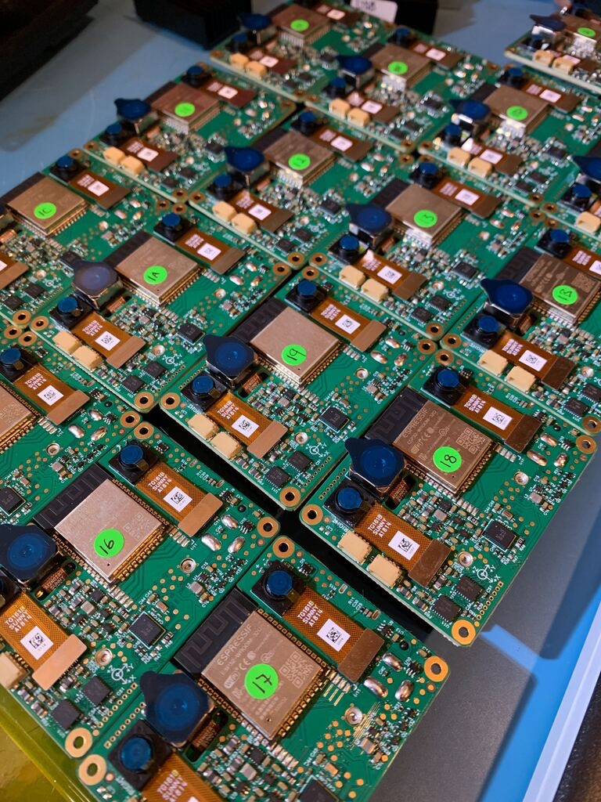

.. _bw1092:

Embedded DepthAI Reference Design with Onboard ESP32 for WiFi and BT (BW1092)
=============================================================================

Overview
********

This design is one of two baseboards for the DepthAI: System on Module (SoM) - Embedded Variant (BW1099EMB).
To read more on the why of this design, see `https://github.com/luxonis/depthai-hardware/issues/10`__ and 
`https://github.com/luxonis/depthai-hardware/issues/9`__.

Key features
************

This design will serves as a reference for multiple purposes:

* How to use the BW1099EMB with microcontrollers over SPI
* How to connect DepthAI as an IoT device to AWS-IoT
* How to use DepthAI without an OS-capable host processor (e.g. with an embedded microcontroller like the ESP32)
* How to use DepthAI with WiFi and BT
* First prototype of DepthAI with an integrated IMU (BNO085)

Alium project files
*******************

See files `here <https://github.com/luxonis/depthai-hardware/tree/master/BW1092_ESP32_Embedded_WIFI_BT/PCB>`__

Project output files
********************

* `Assembly Drawing <https://github.com/luxonis/depthai-hardware/blob/master/BW1092_ESP32_Embedded_WIFI_BT/Docs/Assembly%20Drawing%20PDF/Production.PDF>`__
* `Assembly Outputs <https://github.com/luxonis/depthai-hardware/tree/master/BW1092_ESP32_Embedded_WIFI_BT/Docs/Assembly%20Outputs>`__
* `Fabrication Drawing <https://github.com/luxonis/depthai-hardware/blob/master/BW1092_ESP32_Embedded_WIFI_BT/Docs/Fabrication%20Drawing%20PDF/Production.PDF>`__
* `Fabrication Outputs <https://github.com/luxonis/depthai-hardware/tree/master/BW1092_ESP32_Embedded_WIFI_BT/Docs/Fabrication%20Outputs>`__
* `Schematic <https://github.com/luxonis/depthai-hardware/blob/master/BW1092_ESP32_Embedded_WIFI_BT/Docs/Schematic%20PDF/Production.PDF>`__

3D Models
*********

Download `here <https://github.com/luxonis/depthai-hardware/tree/master/BW1092_ESP32_Embedded_WIFI_BT/3D_Models>`__

.. include::  /pages/includes/footer-short.rst
