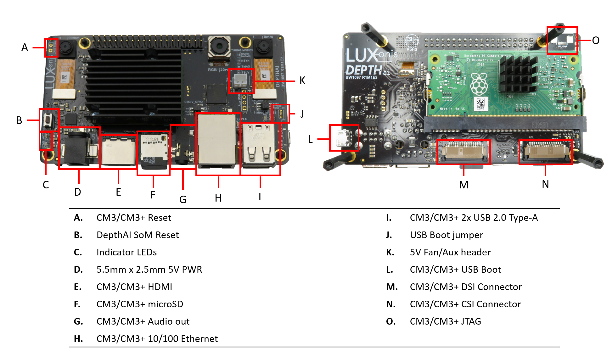
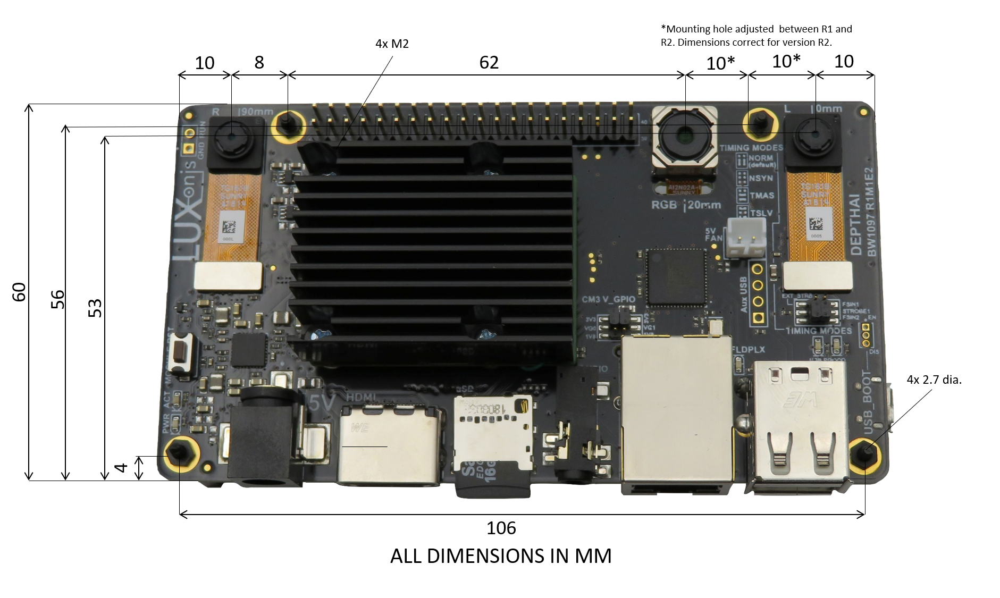

DepthAI for CM3+ (BW1097)
=========================

.. image:: ../../../BW1097_DepthAI_Compute_Module/Images/BW1097_R1M1E2_transparent_crop.png

Overview
********

Board layout & dimensions
*************************

Key features
************

Alium project files
*******************

Project output files
********************

* Assembly Drawing
* Assembly Outputs
* Fabrication Drawing
* Fabrication Outputs
* Schematic

3D Models
*********

.. include::  /pages/includes/footer-short.rst
