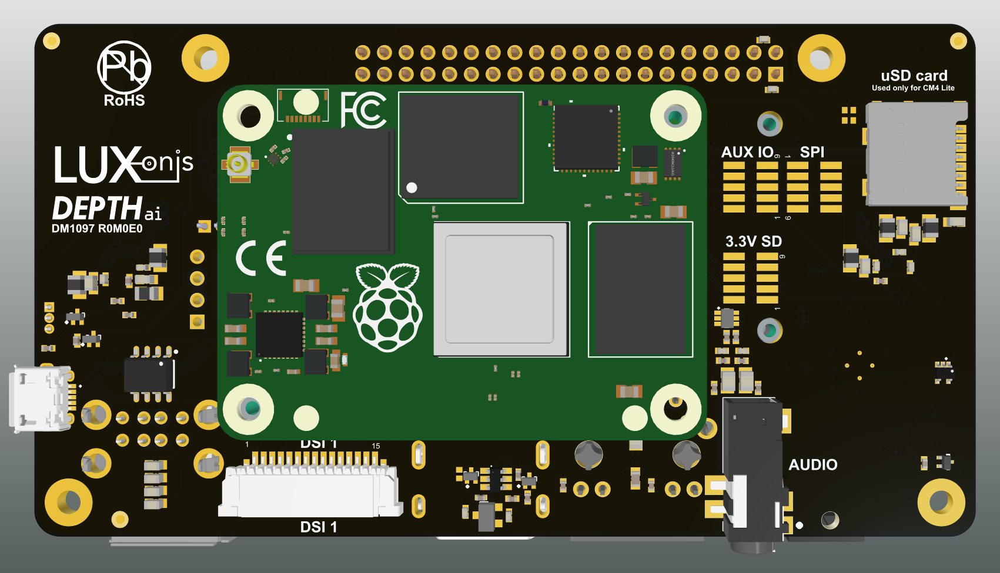
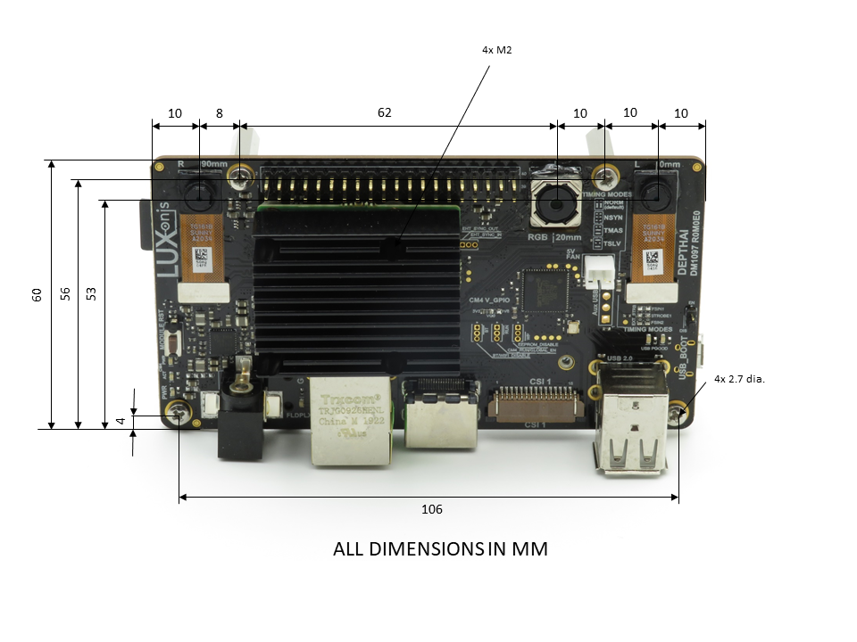

.. _dm1097:

DepthAI for Compute module 4 (DM1097)
=====================================

Overview
********

Board layout & dimensions
*************************

.. image:: ../../../DM1097_DepthAI_Compute_Module_4/Images/DM1097_R0M0E0.jpg

Key features
************

Alium project files
*******************

Project output files
********************

* Assembly Drawing
* Assembly Outputs
* Fabrication Drawing
* Fabrication Outputs
* Schematic

3D Models
*********

.. include::  /pages/includes/footer-short.rst
